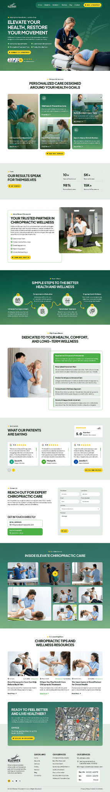
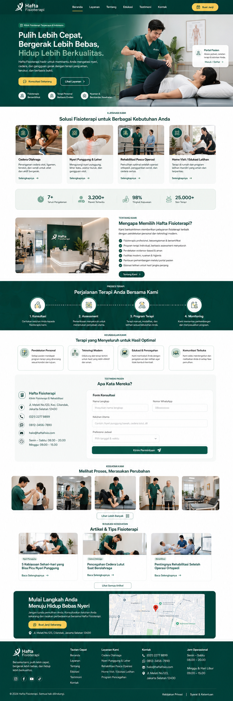
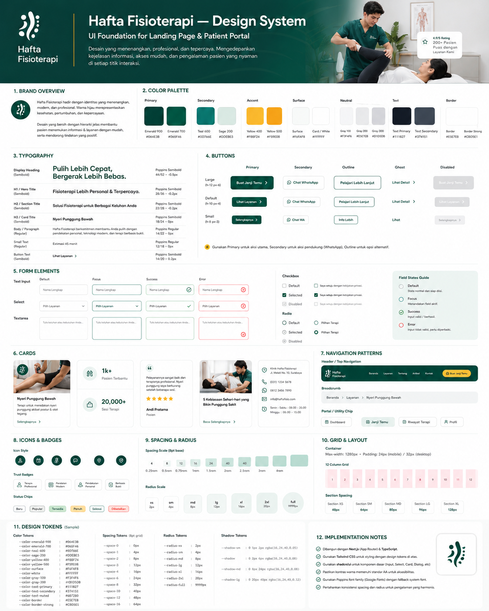

# HAFTA FISIOTERAPI — AI CONTEXT BUNDLE
> Generated from canonical project documentation and execution tasks. Prefer canonical individual files when editing requirements.
> Package version: 0.3.0
> Last updated: 2026-08-12
> IMPORTANT: Real patient data and secrets must never be included in AI prompts.
> RESPONSIVE POLICY: Mobile implementation and Mobile Gate are mandatory before desktop enhancement.

## Agent usage

1. Treat `AGENTS.md` as non-negotiable.
2. Security and authorization rules override UI convenience.
3. For UI work, `DESIGN-REFERENCES.md`, `DESIGN-SYSTEM.md`, and `MOBILE-FIRST-STRATEGY.md` are mandatory.
4. Build mobile/base first; pass Mobile Gate; only then add desktop enhancement.
5. Read the task-specific page specification before implementation.
6. Use `tasks/*.md` only as execution units after canonical docs are understood.
7. This bundle is a convenience snapshot; canonical files remain the editable source of truth.


<!-- BEGIN FILE: AGENTS.md -->

# AGENTS.md — Hafta Fisioterapi

> Status: NON-NEGOTIABLE AI AGENT INSTRUCTIONS
> Version: 0.3.0
> Last updated: 2026-08-12
> Language: Indonesian

## 1. Mission

Anda adalah coding agent yang mengerjakan aplikasi Hafta Fisioterapi. Implementasi harus mengikuti dokumen proyek di repository ini. Jangan mengarang requirement baru ketika requirement sudah didefinisikan.

## 2. Mandatory read order

Sebelum menulis atau mengubah kode, baca file berikut sesuai urutan:

1. `README-AI.md`
2. `docs/MASTER-PRD.md`
3. `docs/ARCHITECTURE.md`
4. `docs/DATABASE.md`
5. `docs/PERMISSIONS.md`
6. `docs/SECURITY.md`
7. `docs/DESIGN-REFERENCES.md`
8. `docs/DESIGN-SYSTEM.md`
9. `docs/MOBILE-FIRST-STRATEGY.md`
10. `docs/UI-GUIDELINES.md`
11. `docs/DEVELOPMENT-WORKFLOW.md`
12. `docs/FORM-SPECIFICATIONS.md`
13. `docs/ROUTE-AND-NAVIGATION.md`
14. task-specific page spec under `docs/pages/`
15. `docs/CONTENT-REQUIREMENTS.md`

Jika context window terbatas, baca minimal: `AGENTS.md`, bagian feature pada `MASTER-PRD.md`, task-specific page spec di `docs/pages/`, lalu dokumen security/permission/database yang terdampak.

Jika bekerja dari file `tasks/*.md`, baca task tersebut setelah canonical docs yang tercantum pada bagian `Read first`. Task file adalah execution unit, bukan policy override.

## 3. Source-of-truth precedence

Jika ada konflik, gunakan urutan prioritas berikut:

1. `AGENTS.md`
2. `docs/SECURITY.md`
3. `docs/PERMISSIONS.md`
4. `docs/DATABASE.md`
5. `docs/MASTER-PRD.md`
6. Task-specific specification under `docs/pages/` / `docs/FORM-SPECIFICATIONS.md`
7. `docs/ARCHITECTURE.md`
8. `docs/DESIGN-SYSTEM.md`
9. `docs/MOBILE-FIRST-STRATEGY.md`
10. `docs/DESIGN-REFERENCES.md`
11. `docs/UI-GUIDELINES.md`
12. Existing code that has already passed review

Jangan menurunkan security demi mengikuti UI atau kemudahan implementasi.

## 4. Locked technology direction

- Next.js latest stable, App Router.
- TypeScript strict.
- Tailwind CSS.
- shadcn/ui.
- Taste Skill sebagai design-quality guardrail.
- React Hook Form + Zod untuk form kompleks.
- Neon PostgreSQL.
- Drizzle ORM.
- Better Auth atau integration layer yang ditetapkan proyek untuk authentication.
- Cloudflare R2 untuk private file storage bila upload dokumen diaktifkan.
- pnpm.
- 9Router hanya merupakan AI routing layer pada workflow development, bukan komponen production aplikasi pasien.

Jangan mengganti framework, ORM, database, auth architecture, atau package manager tanpa keputusan eksplisit dari pemilik proyek.

## 4A. Mobile-first UI rule

All UI development is mobile-first. Base markup/styles MUST be implemented and validated on mobile before tablet/desktop enhancement. Read `docs/MOBILE-FIRST-STRATEGY.md`.

For UI tasks:

```text
Mobile implementation -> Mobile Gate -> Tablet/Desktop enhancement -> Desktop Gate -> Cross-breakpoint QA
```

AI agents MUST NOT start from the desktop mockup and compress it into mobile. The visual reference is a composition guide; the implementation order remains mobile-first.

Canonical visual direction is defined by `docs/DESIGN-SYSTEM.md` and `docs/DESIGN-REFERENCES.md`.

## 5. Folder rules

- Gunakan `app/.../...` untuk route dan composition.
- Semua reusable UI component berada di `components/`.
- Pisahkan komponen berdasarkan domain/feature.
- Business logic server berada di `server/`.
- Database berada di `db/`.
- Authorization dan security utilities berada di `lib/permissions` dan `lib/security`.
- Validation schema berada di `lib/validators` atau dekat domain jika benar-benar feature-specific.
- Jangan membuat `page.tsx` atau component raksasa yang memuat seluruh logic feature.
- Jangan membuat duplicate component jika komponen yang sesuai sudah ada.

## 6. Coding rules

MUST:

- TypeScript strict dan tanpa `any` kecuali alasan tertulis sangat kuat.
- Gunakan descriptive naming.
- Validate semua untrusted input di server.
- Authorization dilakukan server-side pada setiap operasi sensitif.
- Query hanya mengambil data minimum yang diperlukan.
- Gunakan transaction untuk operasi multi-record yang harus atomik.
- Audit operasi sensitif.
- Gunakan soft archive/versioning untuk data klinis; jangan hard-delete rekam klinis.
- Tangani loading, empty, error, unauthorized, forbidden states.
- Tambahkan tests untuk authorization dan business rule kritis.

MUST NOT:

- Menyimpan role atau authorization source-of-truth di `localStorage`.
- Mengandalkan hide/show UI sebagai security.
- Mengekspos database secret, auth secret, storage secret, atau service token ke client bundle.
- Mengirim data pasien nyata ke AI provider, 9Router, logging eksternal, analytics, atau prompt coding agent.
- Menaruh query database langsung di presentational client component.
- Menggunakan hard delete untuk assessment, treatment plan, therapy session, progress note, consent, atau audit log.
- Mengubah database schema tanpa migration.
- Mengabaikan lint/typecheck/tests agar build lolos.

## 7. AI-specific safety

Semua sample data yang digunakan agent harus dummy atau de-identified.

Dilarang memasukkan ke prompt AI:

- nama pasien nyata;
- tanggal lahir pasien;
- nomor telepon;
- alamat;
- diagnosis/keluhan yang dapat dihubungkan ke individu;
- foto pasien;
- dokumen medis;
- session cookie/token;
- environment secrets;
- database dump production.

9Router boleh merutekan permintaan coding, tetapi tidak boleh dijadikan jalur pemrosesan data pasien production.

## 8. Before implementing a feature

Agent wajib menyebut secara internal/commit notes:

- requirement ID yang sedang dikerjakan;
- route yang terdampak;
- tabel yang terdampak;
- permission yang dibutuhkan;
- validation yang dibutuhkan;
- audit event yang dibutuhkan;
- test yang dibutuhkan.

## 9. Definition of done

Feature belum selesai jika salah satu berikut belum terpenuhi:

- requirement terpenuhi;
- Mobile Gate lulus sebelum desktop enhancement;
- Desktop Gate dan cross-breakpoint QA lulus;
- UI responsive dan accessible;
- server-side validation ada;
- server-side authorization ada;
- audit event ada bila diperlukan;
- database migration aman bila schema berubah;
- lint lulus;
- typecheck lulus;
- tests kritis lulus;
- tidak ada secret/data pasien dalam log;
- dokumentasi di-update jika kontrak feature berubah.

<!-- END FILE: AGENTS.md -->

<!-- BEGIN FILE: README-AI.md -->

# README-AI — Hafta Fisioterapi

Dokumen ini adalah entry point untuk manusia dan AI coding agent.

## Tujuan paket

Paket ini mendefinisikan product requirement, arsitektur, database, permission, security, UI rules, dan workflow development Hafta Fisioterapi sebelum implementasi utama dimulai.

Format sengaja menggunakan Markdown UTF-8 dan JSON agar mudah diproses oleh AI agent, editor, CLI agent, GitHub, dan tooling dokumentasi biasa.

## AI bootstrap

Saat agent baru mulai session:

1. Baca `AGENTS.md`.
2. Baca `docs/MASTER-PRD.md`.
3. Baca task-specific specification di `docs/pages/` bila task menyentuh halaman/role tertentu.
4. Jika task menyentuh UI, baca `docs/DESIGN-REFERENCES.md`, `docs/DESIGN-SYSTEM.md`, dan `docs/MOBILE-FIRST-STRATEGY.md`.
5. Baca dokumen domain yang berkaitan dengan task.
6. Periksa existing code sebelum membuat file baru.
7. Untuk UI: selesaikan Mobile Gate sebelum menambahkan desktop enhancement.
8. Buat implementasi sekecil mungkin yang memenuhi requirement.
9. Jalankan validation gates sesuai `docs/DEVELOPMENT-WORKFLOW.md`.

## Dokumen

- `START-DEVELOPMENT.md` — prompt awal dan urutan eksekusi development.
- `docs/MASTER-PRD.md` — product requirements utama.
- `docs/ARCHITECTURE.md` — arsitektur aplikasi dan folder.
- `docs/DATABASE.md` — model data dan persistence rules.
- `docs/PERMISSIONS.md` — RBAC + object-level authorization.
- `docs/SECURITY.md` — security baseline untuk aplikasi data kesehatan.
- `docs/DESIGN-REFERENCES.md` — visual references dan aturan penggunaannya.
- `docs/DESIGN-SYSTEM.md` — canonical visual tokens/components.
- `docs/MOBILE-FIRST-STRATEGY.md` — urutan implementasi mobile → desktop dan responsive gates.
- `docs/UI-GUIDELINES.md` — sistem UI/UX dan Taste Skill guardrails.
- `docs/DEVELOPMENT-WORKFLOW.md` — urutan implementasi dan quality gates.
- `docs/FORM-SPECIFICATIONS.md` — field/form contract untuk patient dan clinical workflow.
- `docs/ROUTE-AND-NAVIGATION.md` — route matrix dan navigation authorization.
- `docs/pages/01-LANDING-PAGE.md` — detail landing page.
- `docs/pages/02-AUTHENTICATION-PAGES.md` — login/register/recovery/verification.
- `docs/pages/03-DASHBOARD-USER.md` — Patient Portal USER.
- `docs/pages/04-DASHBOARD-ADMIN-THERAPIST.md` — workflow ADMIN/Therapist.
- `docs/pages/05-DASHBOARD-SUPER-ADMIN.md` — governance SUPER_ADMIN.
- `docs/CONTENT-REQUIREMENTS.md` — data yang masih harus dikumpulkan dari Hafta.
- `manifest.json` — machine-readable document manifest.

## Important classification

Aplikasi menangani data pasien dan informasi kesehatan. Anggap seluruh clinical data sebagai sensitive data. Gunakan dummy data selama development kecuali ada environment terkontrol dan kebijakan penggunaan data yang sudah disetujui.

## 9Router role

9Router adalah development-time AI gateway/router. 9Router tidak termasuk production request path aplikasi pasien dan tidak boleh menerima patient data production.

## Change policy

Jika requirement berubah:

1. update PRD terlebih dahulu;
2. update permission/database/security docs bila terdampak;
3. baru ubah implementasi;
4. catat breaking change.


## Execution tasks

Folder `tasks/` berisi task implementation-ready yang dapat diberikan langsung ke coding agent setelah canonical docs dibaca. Mulai dari `tasks/README.md`, lalu ikuti dependency/task order. Task files tidak boleh mengoverride security, permission, database, atau Master PRD.

<!-- END FILE: README-AI.md -->

<!-- BEGIN FILE: START-DEVELOPMENT.md -->

# START DEVELOPMENT — Hafta Fisioterapi

> Package: v0.3.0
> Strategy: Mobile-first, then desktop enhancement.

## 1. First AI-agent session

Give the coding agent this instruction:

```text
Read AGENTS.md first.
Then read README-AI.md and the mandatory canonical docs.
For UI work, DESIGN-REFERENCES.md, DESIGN-SYSTEM.md, and MOBILE-FIRST-STRATEGY.md are mandatory.
Use only dummy/de-identified patient data.
Do not start desktop UI before the relevant Mobile Gate passes.

Execute tasks/00-PROJECT-BOOTSTRAP.md.
Stop after its Done criteria pass and report changed files, checks, and unresolved items.
```

## 2. Second session — design foundation

After Task 000 passes:

```text
Read AGENTS.md.
Execute tasks/01-DESIGN-FOUNDATION.md.
Inspect assets/design-references/02-hafta-landing-direction.png and 03-hafta-design-system-board.png if image inspection is supported.
Implement mobile/base visual primitives first.
Validate 320/360/390/430 and pass Mobile Gate before adding desktop variants.
Do not proceed to Landing Page until Done criteria pass.
```

## 3. Third session — landing page

After Task 001 passes:

```text
Read AGENTS.md.
Execute tasks/02-LANDING-PAGE.md.
Use the approved Hafta visual reference and DESIGN-SYSTEM.md.
Stage A: implement mobile landing page first and pass Mobile Gate.
Stage B: only after Stage A passes, implement tablet/desktop enhancements and pass Desktop Gate.
Do not publish placeholder metrics, addresses, credentials, testimonials, or clinical claims as facts.
```

## 4. Development order

```text
HF-TASK-000 Project Bootstrap
      ↓
HF-TASK-001 Design Foundation
      ↓
HF-TASK-002 Landing Page
      ↓
HF-TASK-003 Auth + Database
      ↓
HF-TASK-004 Permission Framework
      ↓
HF-TASK-005 USER Patient Portal
      ↓
HF-TASK-006 ADMIN/Therapist Clinical
      ↓
HF-TASK-007 SUPER_ADMIN
      ↓
HF-TASK-008 Security Hardening
```

For every UI-capable task:

```text
Mobile -> Mobile Gate -> Tablet/Desktop -> Desktop Gate -> QA
```

## 5. Important visual files

```text
assets/design-references/01-layout-reference.png
assets/design-references/02-hafta-landing-direction.png
assets/design-references/03-hafta-design-system-board.png
```

The first file is inspiration only. The second and third represent the approved Hafta direction. Exact tokens live in `docs/DESIGN-SYSTEM.md`.

<!-- END FILE: START-DEVELOPMENT.md -->

<!-- BEGIN FILE: docs/MASTER-PRD.md -->

---
title: Hafta Fisioterapi Master PRD
version: 0.3.0
status: draft-for-validation
last_updated: 2026-08-12
---

# Hafta Fisioterapi — Master Product Requirements Document

## 1. Product summary

Hafta Fisioterapi membutuhkan satu aplikasi web yang menggabungkan:

1. public landing page;
2. authentication: register, login, logout, verification, password recovery;
3. patient portal;
4. staff/admin dashboard;
5. super-admin control panel;
6. patient intake dan clinical record workflow;
7. patient history;
8. access control dan auditability.

Aplikasi bukan sekadar company profile. Landing page menjadi acquisition layer, sedangkan dashboard menjadi operational patient-information system.

## 2. Product goals

### G-001 — Public trust
Menyediakan landing page yang menjelaskan Hafta, layanan, alur terapi, lokasi/kontak, therapist, edukasi, dan akses menuju patient portal.

### G-002 — Structured patient intake
Pasien dapat mendaftar dan mengisi data yang dibutuhkan dengan struktur konsisten sebelum/selama proses fisioterapi.

### G-003 — Therapist workflow
Staff/therapist yang berwenang dapat membuat assessment, treatment plan, session record, progress, dan patient history sesuai permission.

### G-004 — Patient transparency
Pasien dapat melihat data miliknya sendiri yang memang ditandai boleh terlihat oleh pasien.

### G-005 — Secure administration
Super Admin dapat mengelola akun, role/permission, configuration, dan audit tanpa otomatis mendapat akses klinis tanpa alasan.

### G-006 — Maintainability
Codebase harus modular, clean, typed, memiliki migration, authorization test, dan struktur folder yang konsisten.

## 3. Non-goals untuk v1

Tidak termasuk kecuali kemudian disetujui:

- telemedicine/video consultation;
- pembayaran online;
- insurance claim automation;
- public medical diagnosis automation;
- AI diagnosis;
- AI-generated treatment recommendation untuk pasien;
- automatic ingestion data pasien ke AI provider;
- complex inventory/pharmacy system;
- multi-branch enterprise architecture.

## 4. User roles

### R-001 — SUPER_ADMIN
Fokus pada administration, user management, role/permission, configuration, dan audit.

SUPER_ADMIN tidak otomatis mempunyai unrestricted clinical read access. Clinical access harus mengikuti permission eksplisit.

### R-002 — ADMIN
Role staff. Dapat memiliki sub-type seperti `THERAPIST` atau `STAFF` dan scoped permissions.

### R-003 — USER
Patient account. Hanya boleh mengakses data miliknya sendiri dan resource yang secara eksplisit patient-visible.

## 5. Public information architecture

### Route baseline

- `/`
- `/login`
- `/register`
- `/forgot-password`
- `/reset-password`
- `/verify-email`
- `/privacy`
- `/terms`

Optional future public routes:

- `/layanan/[slug]`
- `/edukasi`
- `/edukasi/[slug]`

## 6. Landing page requirements

### LP-001 — Header
Harus memiliki logo/brand, navigation, CTA konsultasi/contact, dan login portal.

### LP-002 — Hero
Harus menjelaskan value Hafta secara ringkas dan tidak membuat klaim medis berlebihan.

Recommended direction:

- positioning: fisioterapi + recovery + patient journey;
- primary CTA: konsultasi/contact;
- secondary CTA: patient portal.

### LP-003 — Services / conditions
Konten final harus menggunakan daftar layanan yang sudah dikonfirmasi client. Jangan mengubah posting edukasi Instagram menjadi klaim layanan resmi tanpa validasi.

### LP-004 — How therapy works
Section yang menjelaskan alur umum:

1. konsultasi/registrasi;
2. data awal;
3. assessment;
4. treatment plan;
5. session/progress;
6. evaluation/completion.

### LP-005 — About Hafta
Menggunakan cerita/positioning resmi dari client.

### LP-006 — Therapist section
Boleh berisi nama, foto, gelar/credential, dan fokus praktik hanya setelah data dikonfirmasi.

### LP-007 — Patient Portal value
Jelaskan manfaat portal tanpa menyatakan fitur yang belum live.

### LP-008 — Education
Boleh mengadaptasi tema edukasi publik dari Hafta setelah content approval.

### LP-009 — Testimonial/recovery story
Hanya gunakan materi pasien dengan consent publikasi yang dapat dibuktikan.

### LP-010 — FAQ
FAQ harus dikonfirmasi oleh operational owner.

### LP-011 — Location/contact
Alamat, nomor, jam operasional, dan channel booking harus dikonfirmasi sebelum production.

### LP-012 — Privacy footer
Link privacy policy dan terms wajib tersedia sebelum menerima data pasien production.

## 7. Authentication requirements

### AUTH-001 — Registration
USER dapat membuat akun menggunakan email/password.

Minimum fields:

- email;
- password;
- password confirmation;
- consent terhadap terms/privacy;
- optional display name jika dibutuhkan.

Patient medical data tidak dikumpulkan pada form register yang sama.

### AUTH-002 — Email verification
Email verification harus didukung sebelum user melakukan operasi sensitif.

### AUTH-003 — Login
Login menggunakan secure session cookie.

### AUTH-004 — Forgot/reset password
Reset token harus short-lived, single-use, dan tidak mengungkap apakah email tertentu terdaftar melalui response yang mudah dieksploitasi.

### AUTH-005 — Staff MFA
MFA sangat direkomendasikan dan menjadi target wajib sebelum production untuk ADMIN dan SUPER_ADMIN.

### AUTH-006 — Session management
Harus ada logout, session expiration, dan mekanisme revoke session untuk staff.

## 8. USER / patient portal

Baseline routes:

- `/dashboard`
- `/dashboard/profile`
- `/dashboard/intake`
- `/dashboard/history`
- `/dashboard/history/[recordId]` jika diperlukan
- `/dashboard/documents` jika feature upload diaktifkan
- `/dashboard/account/security`

### PT-001 — Patient profile
Patient dapat mengisi dan mengubah profile non-clinical sesuai policy.

### PT-002 — Patient intake
Form intake dipisah menjadi beberapa section agar manageable.

Candidate fields:

#### Identity/profile
- full name;
- date of birth;
- sex/gender field hanya jika benar-benar dibutuhkan workflow klinis dan sudah disetujui;
- phone;
- address general/detail sesuai kebutuhan minimum;
- occupation.

#### Emergency contact
- contact name;
- relationship;
- phone.

#### Main complaint
- chief complaint;
- affected area;
- onset date/time range;
- triggering event;
- pain/complaint scale bila digunakan Hafta;
- aggravating activity;
- relieving factors;
- functional limitations.

#### Relevant history
- injury history;
- surgery history;
- relevant medical history;
- medications;
- allergies;
- relevant examination/supporting document.

#### Goal
- patient goal;
- activity/sport goal.

#### Consent
- privacy/data-processing consent;
- clinical data submission acknowledgement;
- optional media/publication consent harus terpisah dan tidak bundled.

Final field list harus disetujui fisioterapis Hafta.

### PT-003 — Intake status
Status candidate:

- `DRAFT`
- `SUBMITTED`
- `UNDER_REVIEW`
- `NEEDS_REVISION`
- `ACCEPTED`

### PT-004 — Patient history
USER hanya dapat melihat record miliknya sendiri yang `patient_visible = true` dan sesuai lifecycle state.

### PT-005 — Patient cannot edit finalized clinical data
Assessment, clinical findings, finalized therapy sessions, dan therapist notes tidak dapat dimodifikasi oleh USER.

## 9. ADMIN / therapist dashboard

Baseline routes:

- `/dashboard`
- `/dashboard/patients`
- `/dashboard/patients/[patientId]`
- `/dashboard/patients/[patientId]/intake`
- `/dashboard/patients/[patientId]/assessment`
- `/dashboard/patients/[patientId]/treatment-plan`
- `/dashboard/patients/[patientId]/sessions`
- `/dashboard/patients/[patientId]/sessions/[sessionId]`
- `/dashboard/patients/[patientId]/history`
- `/dashboard/account/security`

### ADM-001 — Patient list
Admin hanya melihat patient sesuai assigned scope/permission.

Required capabilities:

- search;
- status filter;
- assigned therapist filter bila permitted;
- pagination;
- no sensitive data exposed unnecessarily in table.

### ADM-002 — Patient overview
Summary non-excessive:

- patient identity minimum;
- active complaint summary;
- intake status;
- assigned therapist;
- latest session;
- treatment status.

### ADM-003 — Assessment
Authorized therapist dapat membuat assessment.

Candidate sections:

- subjective assessment;
- objective findings;
- functional findings;
- clinical impression/working assessment according to Hafta workflow;
- measurable baseline;
- therapist notes;
- visibility status.

### ADM-004 — Treatment plan
Authorized therapist dapat membuat treatment plan terkait assessment.

Candidate fields:

- goals;
- planned interventions;
- expected review interval;
- home program;
- precautions;
- status.

### ADM-005 — Therapy sessions
Setiap session memiliki independent record.

Candidate fields:

- session datetime;
- therapist;
- pre-session state;
- interventions;
- response;
- measurements/progress;
- home program changes;
- next plan;
- draft/finalized status;
- patient visibility flag.

### ADM-006 — Finalization
Finalized clinical record tidak boleh di-hard-delete. Correction menggunakan revision/amendment mechanism.

### ADM-007 — Assignment
Patient dapat di-assign ke therapist sesuai permission.

### ADM-008 — Export
Export clinical data adalah privileged operation, default denied, dan wajib audit.

## 10. SUPER_ADMIN dashboard

Routes candidate:

- `/dashboard/users`
- `/dashboard/users/[userId]`
- `/dashboard/staff`
- `/dashboard/roles`
- `/dashboard/audit-logs`
- `/dashboard/settings`

### SA-001 — Account management
Manage account state:

- active;
- suspended;
- disabled;
- invited;
- verification status.

### SA-002 — Role assignment
Role changes wajib audit.

### SA-003 — Permission management
Permission assignment tidak boleh dapat diedit oleh ADMIN biasa.

### SA-004 — Audit viewer
Audit log hanya read-only dari UI normal.

### SA-005 — Clinical access
Super Admin tidak otomatis mempunyai clinical read permission.

## 11. Status model

### Patient case status candidate

- `INTAKE`
- `ACTIVE`
- `ON_HOLD`
- `COMPLETED`
- `REFERRED`
- `ARCHIVED`

Final terminology harus divalidasi bersama Hafta.

### Clinical document state

- `DRAFT`
- `FINALIZED`
- `AMENDED`
- `ARCHIVED`

## 12. Search and filtering

Search harus server-side untuk dataset yang dapat berkembang.

Jangan expose full dataset ke client hanya untuk filtering.

## 13. Audit requirements

Audit minimum:

- login success/failure aggregate dengan privacy-aware logging;
- logout/revoke;
- role change;
- permission change;
- patient record view untuk sensitive clinical views jika feasible;
- patient create/update;
- assessment create/finalize/amend;
- treatment plan create/update/finalize;
- session create/finalize/amend;
- document upload/download/delete/archive;
- data export;
- account suspension/reactivation.

## 14. Notification baseline

V1 boleh hanya menggunakan in-app state tanpa complex notification engine. Email verification/reset tetap memerlukan transactional email provider.

Future notification dapat ditambahkan melalui requirement terpisah.

## 15. Accessibility requirements

- Keyboard accessible.
- Visible focus.
- Semantic labels.
- Form errors terasosiasi ke field.
- Kontras layak.
- Jangan menggunakan warna sebagai satu-satunya status indicator.
- Respect reduced motion.

## 16. Responsive requirements — MOBILE FIRST

Canonical rule: `docs/MOBILE-FIRST-STRATEGY.md`.

- Semua UI dibangun dari base/mobile layout terlebih dahulu.
- AI agent tidak boleh memulai dari desktop lalu mengecilkan layout ke mobile.
- Mobile validation minimum: 320, 360, 390, dan 430px.
- Tablet enhancement setelah Mobile Gate: 768/834px.
- Desktop enhancement hanya setelah Mobile Gate lulus; validate 1024/1280/1440px.
- Landing page, auth, Patient Portal, ADMIN/Therapist, dan SUPER_ADMIN mengikuti urutan ini.
- Forms mobile single-column by default.
- Tables besar harus memiliki mobile strategy: compact card/list, priority columns, contained horizontal scroll, atau detail drill-down.
- Tidak boleh ada body-level horizontal overflow.
- Desktop boleh meningkatkan density/composition tetapi tidak boleh mengubah hierarchy inti atau menambahkan hover-only operation.
- Mobile Gate + Desktop Gate + cross-breakpoint QA adalah Definition of Done untuk UI.

## 17. Performance requirements

- Gunakan Server Components secara default jika tidak membutuhkan interactivity client.
- Client Component hanya ketika diperlukan.
- Pagination untuk large lists.
- Hindari over-fetching.
- Optimize images.
- Jangan mengirim clinical payload yang tidak sedang dilihat user.

## 18. Data retention/deletion

Data retention klinis tidak boleh ditentukan oleh coding agent. Policy final harus mengikuti kebutuhan Hafta dan kewajiban hukum/rekam medis yang berlaku.

Account deletion oleh patient tidak otomatis berarti hard-delete seluruh clinical record.

## 19. Privacy requirements

- Data minimization.
- Purpose limitation.
- Explicit consent where required.
- Separate public-media consent dari service/clinical consent.
- Access based on need-to-know.
- No patient data in AI development prompts.

## 20. Analytics

Public landing analytics boleh digunakan setelah privacy review.

Jangan kirim clinical page content, patient identifiers, complaint text, diagnosis, atau document names ke third-party analytics.

## 21. Acceptance criteria v1

V1 dianggap layak staging jika:

- public landing page complete dengan validated content placeholders;
- register/login/verification/reset bekerja;
- USER dapat mengisi intake;
- ADMIN yang permitted dapat melihat assigned patient dan membuat clinical records;
- USER tidak dapat melihat patient lain;
- ADMIN tanpa permission tidak dapat membuka resource melalui direct URL/API/action;
- SUPER_ADMIN dapat mengelola akun/permission dan audit;
- clinical hard delete tidak tersedia;
- security tests kritis lulus;
- audit log untuk sensitive mutations bekerja;
- secrets tidak bocor ke client/log/repository;
- production patient data tidak pernah dikirim ke AI agent.


## 22. Detailed implementation specifications

Master PRD ini menentukan kebijakan produk utama. Implementasi halaman harus membaca spesifikasi detail berikut:

- `docs/DESIGN-REFERENCES.md` — original inspiration, approved Hafta mockup, dan reference precedence.
- `docs/DESIGN-SYSTEM.md` — palette, typography, spacing, components, states, accessibility.
- `docs/MOBILE-FIRST-STRATEGY.md` — responsive implementation order dan QA gates.
- `docs/pages/01-LANDING-PAGE.md` — landing page, section, CTA, content state, SEO, responsive, acceptance criteria.
- `docs/pages/02-AUTHENTICATION-PAGES.md` — login, register, verification, forgot/reset password, auth UX dan security states.
- `docs/pages/03-DASHBOARD-USER.md` — Patient Portal USER, own-data scope, intake, history, documents, security.
- `docs/pages/04-DASHBOARD-ADMIN-THERAPIST.md` — patient list, intake review, assessment, treatment plan, sessions, finalization/amendment.
- `docs/pages/05-DASHBOARD-SUPER-ADMIN.md` — account, staff, role/permission, audit, settings, clinical-access gate.
- `docs/FORM-SPECIFICATIONS.md` — candidate field contract dan form lifecycle.
- `docs/ROUTE-AND-NAVIGATION.md` — route/access matrix.

Jika detail page spec membutuhkan perubahan terhadap product policy di Master PRD, update Master PRD terlebih dahulu. Security, permissions, dan database integrity tidak boleh diturunkan oleh page spec.

<!-- END FILE: docs/MASTER-PRD.md -->

<!-- BEGIN FILE: docs/SECURITY.md -->

---
title: Hafta Fisioterapi Security Baseline
version: 0.1.0
last_updated: 2026-08-12
classification: sensitive-application-guidance
---

# Security Baseline

## 1. Threat model summary

Aplikasi akan menyimpan identitas pasien dan data kesehatan/clinical record. Dampak akses tidak sah dapat tinggi.

Primary threats:

- account takeover;
- broken access control / IDOR;
- privilege escalation;
- credential stuffing/brute force;
- session theft;
- unsafe file upload/download;
- accidental data leakage through logs/analytics;
- secret leakage;
- SQL/data integrity errors;
- malicious/stale AI-generated code;
- insider over-permission;
- destructive clinical record edits.

## 2. Authentication

Use established auth library/integration; do not build password auth primitives manually.

Requirements:

- secure password hashing from auth library;
- email verification;
- reset token expiration + single use;
- session revocation;
- rate limiting for auth-sensitive endpoints/actions;
- MFA for ADMIN and SUPER_ADMIN before production;
- generic login/reset responses where user enumeration is a concern.

OWASP currently prefers Argon2id for new custom password storage. If using Better Auth default secure password handling, do not bypass it just to manually add bcrypt.

## 3. Password policy

- Allow password manager use.
- Do not silently truncate.
- Avoid arbitrary composition rules that harm usability.
- Add minimum length based on current auth guidance.
- Consider compromised-password defense if integration is available and privacy-safe.

## 4. Session security

Cookie/session requirements:

- HttpOnly;
- Secure in production;
- appropriate SameSite;
- session rotation/revocation supported;
- no auth token in localStorage;
- no role source-of-truth in client state.

## 5. Authorization

Authorization must happen server-side for every sensitive read/mutation.

Never rely only on:

- middleware/proxy;
- hidden button;
- route navigation guard;
- client component check;
- unpredictable UUID.

Implement permission + object scope checks according to `PERMISSIONS.md`.

## 6. Input validation

All external input is untrusted:

- form payload;
- URL params;
- query params;
- headers;
- file metadata;
- server action arguments.

Use Zod at trust boundary.

Database constraints remain necessary even when Zod exists.

## 7. SQL/database security

- Use Drizzle parameterized queries.
- Do not construct raw SQL from user input.
- Database credentials server-only.
- Separate development/preview/production databases.
- Production access limited to minimum personnel.
- Review migration before production.

## 8. Clinical record integrity

- Drafts can be edited by authorized author/scope.
- Finalized records cannot be silently overwritten.
- Corrections create amendment/version history.
- No ordinary hard delete.
- Finalize/amend actions create audit event.

## 9. File upload security

When document upload is enabled:

- private bucket;
- explicit allowed MIME/content types;
- file-size limit;
- randomized storage keys;
- never trust original extension;
- malware scanning strategy for production if feasible;
- do not execute uploaded content;
- signed, short-lived download URL after authorization;
- no public directory listing;
- audit sensitive downloads where policy requires.

## 10. Logging

MUST NOT log:

- passwords;
- reset tokens;
- session cookies;
- auth secrets;
- storage signed URLs if reusable;
- raw patient clinical notes;
- full patient document contents;
- full database connection string.

Audit metadata should describe action, not replicate sensitive record content.

## 11. Analytics/privacy

Never send these to public analytics:

- patient ID where avoidable;
- medical record number;
- name/email/phone;
- complaint/diagnosis/free text;
- document name/content;
- therapist notes;
- URL containing patient-sensitive params.

Prefer analytics only for public marketing pages unless a privacy review approves otherwise.

## 12. CSRF/request safety

Use framework/auth mechanisms appropriately. For cookie-authenticated mutations, ensure requests cannot be forged cross-site through the chosen Server Action/route design and auth library protections.

Do not create state-changing GET routes.

## 13. XSS/content safety

- Avoid `dangerouslySetInnerHTML` for patient-supplied content.
- If rich text is introduced, sanitize using an established sanitizer.
- Escape output by default through React.

## 14. Security headers

Production should review and configure:

- Content-Security-Policy;
- frame-ancestors / anti-clickjacking policy;
- Referrer-Policy;
- Permissions-Policy where relevant;
- HSTS on controlled HTTPS domain.

CSP must be tested with Next.js deployment and third-party integrations.

## 15. Rate limiting

Apply risk-based limits to:

- login;
- register;
- reset password;
- resend verification;
- privileged export;
- sensitive search endpoint if abuse risk exists;
- signed URL generation.

Rate limit implementation must work in deployed runtime, not only in-memory per instance.

## 16. Secrets management

- `.env*` production secrets never committed.
- `.env.example` contains keys only, no real values.
- Rotate secret if accidentally exposed.
- Use platform secret/environment management.
- Client-exposed env names must be intentionally public.

## 17. AI/9Router policy

9Router and coding agents are development tools only.

Allowed:

- source code;
- dummy schema examples;
- anonymized fixtures;
- public requirements;
- sanitized errors without patient content.

Forbidden:

- production database dumps;
- real patient records;
- real patient images;
- actual documents;
- secrets/tokens/cookies;
- live clinical free text.

If an AI tool needs a bug reproduction, create synthetic data.

## 18. Dependency security

- Minimize dependencies.
- Use lockfile.
- Review package provenance and maintenance.
- Keep framework/auth/security dependencies updated intentionally.
- Do not blindly run AI-suggested install commands.

## 19. Error responses

Client response:

- generic where needed;
- no stack trace;
- no SQL details;
- no secret values;
- do not reveal existence of unauthorized patient resource unnecessarily.

Server logging can include request correlation ID without sensitive payload.

## 20. Backup and recovery

Before clinical production:

- backup strategy documented;
- restore test completed;
- incident owner defined;
- recovery objectives discussed;
- production plan reviewed beyond free-tier assumptions.

## 21. Security testing gates

Required before production:

- authorization matrix tests;
- direct-object access tests;
- authentication abuse tests;
- session invalidation tests;
- file access tests;
- input validation tests;
- dependency review;
- secret scan;
- production logging review;
- backup/restore check.

## 22. Legal/compliance note

Clinical and personal data processing must be reviewed against applicable Indonesian privacy and health-record obligations before launch. Technical documents here are engineering guidance, not a legal opinion.

<!-- END FILE: docs/SECURITY.md -->

<!-- BEGIN FILE: docs/PERMISSIONS.md -->

---
title: Hafta Fisioterapi Permissions
version: 0.1.0
last_updated: 2026-08-12
---

# Permissions and Authorization

## 1. Model

Gunakan RBAC untuk coarse role + object-level/resource authorization untuk scope pasien.

Role saja tidak cukup.

Authorization equation:

```text
ALLOW = authenticated
    AND permission_present
    AND resource_scope_allowed
    AND record_state_allows_action
```

Default = DENY.

## 2. Baseline permission keys

### Patient domain

- `patient:list`
- `patient:read`
- `patient:create`
- `patient:update-demographics`
- `patient:assign`
- `patient:archive`
- `patient:export`

### Intake

- `intake:read`
- `intake:create-own`
- `intake:update-own-draft`
- `intake:review`
- `intake:request-revision`
- `intake:accept`

### Assessment

- `assessment:read`
- `assessment:create`
- `assessment:update-draft`
- `assessment:finalize`
- `assessment:amend`

### Treatment plan

- `treatment-plan:read`
- `treatment-plan:create`
- `treatment-plan:update-draft`
- `treatment-plan:finalize`
- `treatment-plan:amend`

### Therapy sessions

- `session:read`
- `session:create`
- `session:update-draft`
- `session:finalize`
- `session:amend`

### Documents

- `document:list`
- `document:upload`
- `document:read`
- `document:download`
- `document:archive`

### Administration

- `user:list`
- `user:read`
- `user:suspend`
- `user:reactivate`
- `role:assign`
- `permission:manage`
- `audit:read`
- `settings:manage`

## 3. Role baseline

Legend:

- Y = baseline yes
- S = scoped/conditional
- N = default denied

| Permission | SUPER_ADMIN | ADMIN/THERAPIST | ADMIN/STAFF | USER |
|---|---:|---:|---:|---:|
| patient:list | S | S | S | N |
| patient:read | S | S | S-minimum | own |
| patient:create | Y | S | S | N |
| patient:update-demographics | S | S | S | own-limited |
| patient:assign | Y | S | N | N |
| patient:archive | S | N/S | N | N |
| patient:export | S-explicit | S-explicit | N | own-policy |
| intake:read | S | S | S-minimum | own |
| intake:create-own | N | N | N | Y |
| intake:update-own-draft | N | N | N | Y |
| intake:review | N/S | Y-scoped | S-minimum | N |
| assessment:read | explicit | Y-scoped | N | visible-own |
| assessment:create | explicit | Y-scoped | N | N |
| assessment:update-draft | explicit | Y-owner/scoped | N | N |
| assessment:finalize | explicit | Y-owner/scoped | N | N |
| assessment:amend | explicit | Y-owner/scoped | N | N |
| treatment-plan:* | explicit | scoped | N | read-visible-own |
| session:* | explicit | scoped | N | read-visible-own |
| role:assign | Y | N | N | N |
| permission:manage | Y | N | N | N |
| audit:read | Y | N/S-limited | N | N |
| settings:manage | Y | N | N | N |

`SUPER_ADMIN` clinical permissions are explicit, not implied.

## 4. Resource scope checks

### USER

```ts
resource.patient.userId === session.user.id
```

and field/record must be patient-visible.

### ADMIN/THERAPIST

Typical policy:

```text
active patient assignment
OR approved coverage permission
AND clinical permission
```

### ADMIN/STAFF

Can view administrative subset only. Clinical notes hidden unless explicit clinical responsibility is later introduced.

## 5. Direct URL protection

The following must return forbidden/not found safely if unauthorized even when user manually enters URL:

- `/dashboard/patients/[patientId]`
- assessment routes;
- session routes;
- document download routes;
- audit route;
- user administration routes.

## 6. Server action pattern

```ts
export async function updateAssessment(input: unknown) {
  const session = await requireSession();
  const data = assessmentUpdateSchema.parse(input);
  const assessment = await getAssessmentMinimal(data.id);

  await authorize({
    session,
    permission: "assessment:update-draft",
    resource: assessment,
  });

  if (assessment.status !== "DRAFT") {
    throw new RecordFinalizedError();
  }

  // service + transaction + audit
}
```

## 7. Field-level exposure

Response object untuk USER tidak otomatis sama dengan response untuk therapist.

Gunakan DTO/select eksplisit:

- `PatientSelfView`
- `PatientAdministrativeView`
- `PatientClinicalView`

## 8. Permission tests — mandatory

Minimal test matrix:

1. USER A cannot read USER B patient.
2. USER cannot mutate finalized clinical record.
3. unassigned therapist cannot read patient if policy requires assignment.
4. assigned therapist can perform allowed clinical action.
5. staff admin cannot read clinical notes.
6. super admin without clinical permission cannot read clinical notes.
7. permission change immediately affects next server authorization check.
8. hidden UI route remains protected through direct request.
9. document signed URL cannot be generated without resource authorization.
10. export requires explicit permission and creates audit event.

<!-- END FILE: docs/PERMISSIONS.md -->

<!-- BEGIN FILE: docs/DATABASE.md -->

---
title: Hafta Fisioterapi Database Design
version: 0.1.0
last_updated: 2026-08-12
---

# Database Design

## 1. Platform

Primary relational database: Neon PostgreSQL.
ORM/migration: Drizzle ORM.

File binary tidak disimpan di PostgreSQL. Simpan metadata di PostgreSQL dan object di private object storage.

## 2. General data rules

- Semua table utama memiliki stable ID.
- Tambahkan `created_at` dan `updated_at` bila relevan.
- Clinical table harus mempunyai lifecycle status.
- Clinical record final tidak hard-delete.
- Gunakan transaction untuk finalization + audit.
- Foreign key constraints wajib bila relasi membutuhkan integrity.
- Unique constraints harus dinyatakan di database, bukan hanya UI validation.
- Index hanya dibuat berdasarkan access pattern nyata.

## 3. Core entities

### 3.1 `users`
Authentication identity dikelola sesuai schema Better Auth/integration actual.

Jangan duplicate plaintext credential field di domain table.

### 3.2 `profiles`
Candidate fields:

- `user_id`
- `display_name`
- `phone`
- `avatar_key` optional
- `account_type`
- timestamps

### 3.3 `staff_profiles`

- `id`
- `user_id`
- `staff_type` (`THERAPIST`, `STAFF`)
- `professional_title` nullable
- `credential_summary` nullable
- `is_active`

### 3.4 `patients`

- `id`
- `user_id` nullable if staff-created pre-account record is later required
- `medical_record_number` optional internal unique identifier
- `full_name`
- `date_of_birth`
- `phone`
- `occupation` nullable
- `case_status`
- timestamps
- archive metadata

Do not collect fields not required by validated workflow.

### 3.5 `patient_emergency_contacts`

- `id`
- `patient_id`
- `name`
- `relationship`
- `phone`

### 3.6 `patient_assignments`

- `id`
- `patient_id`
- `staff_id`
- `assignment_type`
- `active_from`
- `active_until` nullable
- `created_by`

Partial unique/logic should prevent duplicate active assignment when inappropriate.

### 3.7 `patient_intakes`

- `id`
- `patient_id`
- `version`
- `status`
- `chief_complaint`
- `affected_area`
- `onset_text` or validated date fields
- `trigger_event`
- `complaint_scale` nullable
- `aggravating_factors`
- `relieving_factors`
- `functional_limitations`
- `injury_history`
- `surgery_history`
- `medical_history`
- `medications`
- `allergies`
- `patient_goal`
- `submitted_at`
- timestamps

Highly sensitive free-text fields must never be included in third-party analytics/logging.

### 3.8 `assessments`

- `id`
- `patient_id`
- `therapist_id`
- `intake_id` nullable/reference
- `status`
- `subjective_summary`
- `objective_findings`
- `functional_findings`
- `clinical_impression`
- `baseline_measurements` JSONB only if flexible structure is justified; prefer normalized fields for queryable metrics
- `patient_visible`
- `finalized_at`
- `finalized_by`
- timestamps

### 3.9 `assessment_amendments`

- `id`
- `assessment_id`
- `reason`
- `changes_summary`
- `created_by`
- `created_at`

Detailed version strategy can use immutable version rows instead; choose one model before implementation.

### 3.10 `treatment_plans`

- `id`
- `patient_id`
- `assessment_id`
- `therapist_id`
- `status`
- `goals`
- `planned_interventions`
- `review_plan`
- `home_program`
- `precautions`
- `patient_visible`
- `finalized_at`
- timestamps

### 3.11 `therapy_sessions`

- `id`
- `patient_id`
- `therapist_id`
- `treatment_plan_id` nullable
- `session_at`
- `status`
- `pre_session_state`
- `interventions`
- `response`
- `progress_measurements`
- `home_program_update`
- `next_plan`
- `patient_visible`
- `finalized_at`
- timestamps

### 3.12 `session_amendments`

Sama seperti assessment amendment; tidak replace original without history.

### 3.13 `patient_documents`

- `id`
- `patient_id`
- `uploaded_by`
- `storage_key`
- `original_filename` optional and protected
- `mime_type`
- `size_bytes`
- `document_type`
- `checksum` optional
- `patient_visible`
- `status`
- timestamps

Object storage bucket private.

### 3.14 `consents`

- `id`
- `patient_id`
- `consent_type`
- `policy_version`
- `granted`
- `granted_at`
- `revoked_at` nullable
- `evidence_metadata`

Consent media/publication harus terpisah dari privacy/service consent.

### 3.15 `roles`
Jika Better Auth/plugin menyimpan role secara sederhana, tetap pastikan domain permission model konsisten.

Role fixed baseline:

- `SUPER_ADMIN`
- `ADMIN`
- `USER`

### 3.16 `permissions`
Candidate permission keys didefinisikan di `PERMISSIONS.md`.

### 3.17 `role_permissions`
Mapping role -> permission bila menggunakan database-backed permission.

### 3.18 `user_permissions`
Optional explicit overrides. Avoid complexity unless truly needed.

### 3.19 `audit_logs`

- `id`
- `actor_user_id` nullable for system
- `actor_role_snapshot`
- `action`
- `resource_type`
- `resource_id`
- `patient_id` nullable
- `result` (`SUCCESS`, `DENIED`, `FAILED`)
- `request_id`
- `ip_hash` or privacy-conscious network metadata if policy allows
- `user_agent_summary` optional
- `metadata` limited JSONB, NEVER include raw clinical content/secrets
- `created_at`

Audit log should be append-only from normal application flows.

## 4. Relationship overview

```text
user 1---1 profile
user 1---0..1 staff_profile
user 1---0..1 patient

patient 1---N patient_intake
patient 1---N patient_assignment N---1 staff_profile
patient 1---N assessment
patient 1---N treatment_plan
patient 1---N therapy_session
patient 1---N patient_document
patient 1---N consent

assessment 1---N amendments
therapy_session 1---N amendments
```

## 5. Record lifecycle

Clinical record rules:

```text
DRAFT
  -> FINALIZED
      -> AMENDED (through explicit amendment/version)
      -> ARCHIVED (policy-driven, not ordinary delete)
```

A finalized record cannot silently return to draft.

## 6. Object-level access

Every patient-linked query must scope by authorization policy before returning data.

Examples:

- USER: `patient.user_id == session.user.id`
- therapist: active assignment OR explicit clinical permission according to policy
- staff: only minimum data required by role
- super admin: administrative access does not imply clinical data access

## 7. Sensitive field handling

Avoid putting clinical free text in:

- URL query params;
- cache keys;
- analytics events;
- error messages;
- audit metadata;
- client-side persistent storage.

## 8. Seed data

Development seed must use obviously fictitious names and complaints.

Do not seed from real Instagram patient stories.

## 9. Migration rules

Every schema change:

1. update `db/schema/*`;
2. generate/review migration;
3. verify backward/forward impact;
4. review data loss risk;
5. run against development database;
6. update docs if domain model changes.

Never use destructive migration against production without explicit reviewed plan.

## 10. Backup/recovery

Before production patient data, define:

- automated backup capability;
- retention;
- point-in-time recovery strategy if plan supports it;
- restore test;
- incident ownership.

Free-tier database limits are acceptable for development, not automatically sufficient for clinical production.

<!-- END FILE: docs/DATABASE.md -->

<!-- BEGIN FILE: docs/ARCHITECTURE.md -->

---
title: Hafta Fisioterapi Application Architecture
version: 0.1.0
last_updated: 2026-08-12
---

# Architecture

## 1. Architecture principle

Gunakan modular monolith Next.js. Satu repository dan satu deployable application pada v1, dengan boundary domain yang tegas.

Tidak perlu microservices untuk MVP.

## 2. Runtime direction

Current verified direction saat dokumen dibuat:

- Next.js latest stable menggunakan App Router.
- Gunakan Node runtime untuk server feature yang memerlukan package Node compatibility.
- Database: Neon PostgreSQL.
- ORM: Drizzle.

Jangan hardcode nomor versi di code-generation prompt. Gunakan lockfile repository sebagai source of truth setelah project diinisialisasi.

## 3. Logical layers

```text
Browser
  |
  v
Next.js App Router
  |
  +-- Route / Page Composition
  +-- Server Actions / Route Handlers
  |
  v
Authentication + Authorization
  |
  v
Domain Services
  |
  +-- Validation
  +-- Business Rules
  +-- Audit Events
  |
  v
Repository / Drizzle Queries
  |
  v
Neon PostgreSQL

Private documents:
Next.js -> authorization -> signed storage access -> Cloudflare R2
```

## 4. Recommended repository structure

```text
/
├── AGENTS.md
├── README-AI.md
├── manifest.json
├── docs/
│   ├── MASTER-PRD.md
│   ├── ARCHITECTURE.md
│   ├── DATABASE.md
│   ├── PERMISSIONS.md
│   ├── SECURITY.md
│   ├── UI-GUIDELINES.md
│   ├── DEVELOPMENT-WORKFLOW.md
│   └── CONTENT-REQUIREMENTS.md
│
├── app/
│   ├── (public)/
│   │   ├── layout.tsx
│   │   └── page.tsx
│   ├── (auth)/
│   │   ├── layout.tsx
│   │   ├── login/page.tsx
│   │   ├── register/page.tsx
│   │   ├── forgot-password/page.tsx
│   │   └── reset-password/page.tsx
│   ├── dashboard/
│   │   ├── layout.tsx
│   │   ├── page.tsx
│   │   ├── profile/page.tsx
│   │   ├── intake/page.tsx
│   │   ├── history/page.tsx
│   │   ├── patients/
│   │   │   ├── page.tsx
│   │   │   └── [patientId]/
│   │   │       ├── page.tsx
│   │   │       ├── intake/page.tsx
│   │   │       ├── assessment/page.tsx
│   │   │       ├── treatment-plan/page.tsx
│   │   │       ├── sessions/page.tsx
│   │   │       ├── sessions/[sessionId]/page.tsx
│   │   │       └── history/page.tsx
│   │   ├── users/page.tsx
│   │   ├── staff/page.tsx
│   │   ├── roles/page.tsx
│   │   ├── audit-logs/page.tsx
│   │   └── settings/page.tsx
│   └── api/
│       └── auth/[...all]/route.ts
│
├── components/
│   ├── ui/
│   ├── landing/
│   │   ├── hero/
│   │   ├── services/
│   │   ├── process/
│   │   ├── about/
│   │   ├── therapists/
│   │   ├── portal/
│   │   ├── faq/
│   │   └── contact/
│   ├── auth/
│   ├── dashboard/
│   └── patient/
│
├── db/
│   ├── index.ts
│   ├── schema/
│   │   ├── auth.ts
│   │   ├── profiles.ts
│   │   ├── patients.ts
│   │   ├── assignments.ts
│   │   ├── intakes.ts
│   │   ├── assessments.ts
│   │   ├── treatment-plans.ts
│   │   ├── sessions.ts
│   │   ├── documents.ts
│   │   ├── consents.ts
│   │   └── audit-logs.ts
│   ├── migrations/
│   └── seed/
│
├── server/
│   ├── actions/
│   ├── queries/
│   ├── services/
│   └── repositories/
│
├── lib/
│   ├── auth/
│   ├── permissions/
│   ├── validators/
│   ├── security/
│   ├── constants/
│   └── utils/
│
├── hooks/
├── types/
├── config/
├── public/
└── tests/
    ├── unit/
    ├── integration/
    └── authorization/
```

## 5. Component boundary

### `app/`
Route composition, layout, metadata, route handlers, server entry points.

### `components/`
UI. Presentational component tidak melakukan privileged database operation.

### `server/actions/`
Mutation entry point. Selalu re-check session, input validation, authorization, domain rule.

### `server/queries/`
Read operations dengan scoped authorization.

### `server/services/`
Business workflow seperti finalize assessment, assign therapist, amend session.

### `server/repositories/`
Database access abstraction untuk query yang kompleks/reused.

### `db/`
Schema, connection, migrations, seed.

### `lib/permissions/`
Permission constants, policy evaluation, resource scope checks.

## 6. Server-first rule

Default gunakan Server Components.

Gunakan Client Component hanya untuk:

- local interaction state;
- complex controlled inputs;
- browser-only APIs;
- interactive charts/widgets;
- shadcn primitives yang memerlukan client behavior.

Jangan menandai entire dashboard sebagai `use client` hanya karena beberapa komponen interaktif.

## 7. Data flow pattern

Example mutation:

```text
UI submit
 -> Server Action
 -> parse Zod schema
 -> require authenticated session
 -> authorize(action, resource)
 -> domain service
 -> transaction
 -> database write
 -> audit write
 -> revalidate affected route/tag
 -> safe response
```

## 8. Error model

Gunakan typed domain errors, misalnya:

- `UnauthenticatedError`
- `ForbiddenError`
- `ValidationError`
- `ConflictError`
- `NotFoundError`
- `RecordFinalizedError`

Jangan mengirim stack trace internal ke client production.

## 9. ID strategy

Gunakan non-sequential public identifiers seperti UUID/ULID yang didukung stack.

Tetap lakukan authorization. Unpredictable ID bukan access control.

## 10. 9Router architecture boundary

```text
Coding Agent
   |
   v
9Router local gateway
   |
   +-- configured model/provider A
   +-- configured model/provider B
   +-- fallback provider
   |
   v
Local source code / repository
```

9Router tidak ditempatkan dalam:

```text
Patient browser -> production app -> database
```

Tidak ada patient runtime request yang membutuhkan 9Router.

## 11. Dependency rule

UI may depend on domain types/contracts.
Domain service may depend on repositories.
Repositories may depend on Drizzle/db.

Database layer tidak boleh mengimpor UI.
Permission/security layer tidak boleh tergantung pada page component.

## 12. Architecture decision records

Untuk perubahan besar buat `docs/adr/NNNN-title.md` dengan:

- context;
- decision;
- alternatives;
- security impact;
- migration impact;
- consequences.

<!-- END FILE: docs/ARCHITECTURE.md -->

<!-- BEGIN FILE: docs/DESIGN-REFERENCES.md -->

---
title: Hafta Fisioterapi Design References
version: 0.3.0
last_updated: 2026-08-12
status: approved-direction
---

# Design References

## 1. Purpose

Dokumen ini mengunci sumber referensi visual yang harus dibaca AI coding agent sebelum mengimplementasikan halaman publik, authentication UI, Patient Portal, ADMIN/Therapist dashboard, atau SUPER_ADMIN dashboard.

Referensi visual digunakan untuk **arah komposisi, hierarchy, rhythm, card treatment, photography placement, CTA treatment, dan perceived quality**. Referensi bukan sumber kebenaran untuk copy, alamat, angka statistik, klaim klinis, nomor telepon, jam operasional, nama pasien, atau credential therapist.

## 2. Reference precedence

Jika terjadi perbedaan visual, gunakan prioritas berikut:

1. `docs/DESIGN-SYSTEM.md` — token dan rule implementasi yang canonical.
2. `assets/design-references/03-hafta-design-system-board.png` — visual design-system board.
3. `assets/design-references/02-hafta-landing-direction.png` — approved Hafta visual direction.
4. `assets/design-references/01-layout-reference.png` — third-party/reference layout inspiration only.
5. `docs/UI-GUIDELINES.md` — general UX guardrails.

Security, accessibility, content accuracy, dan clinical workflow selalu memiliki prioritas lebih tinggi daripada visual reference.

## 3. Original layout reference



File:

```text
assets/design-references/01-layout-reference.png
```

### What to learn from it

Gunakan sebagai inspirasi untuk:

- long-form healthcare landing page;
- alternation antara white/light surface dan branded section;
- hero dengan strong CTA hierarchy;
- service cards yang mudah discan;
- stat/trust strip;
- image + content split sections;
- process timeline;
- testimonial cards;
- contact/form block;
- gallery/editorial content;
- final CTA + location;
- structured footer.

### What must NOT be copied

Jangan menyalin secara 1:1:

- logo/brand;
- exact text/copy;
- clinic claims;
- patient/testimonial identity;
- images;
- exact color palette;
- exact dimensions;
- unique branded illustrations;
- contact information;
- proprietary visual assets.

Implementasi Hafta harus menjadi karya sendiri yang mengikuti brand Hafta dan dokumen project ini.

## 4. Approved Hafta landing-page visual direction



File:

```text
assets/design-references/02-hafta-landing-direction.png
```

### Visual language to preserve

- dominant deep emerald/forest green;
- teal supporting color;
- soft sage/mint supporting surfaces;
- generous white/off-white space;
- yellow used sparingly as action accent;
- modern healthcare photography;
- strong but calm hero;
- clean rounded cards;
- restrained shadows;
- friendly icon circles;
- readable informational hierarchy;
- patient-portal awareness integrated without making landing page feel like SaaS.

### Content warning

Text, addresses, metrics, hours, ratings, names, map labels, and contact details visible inside the mockup are **visual placeholders unless separately confirmed in canonical content documentation**.

AI agents MUST NOT extract those placeholder values and publish them as production facts.

## 5. Approved design-system visual board



File:

```text
assets/design-references/03-hafta-design-system-board.png
```

The implementation counterpart is:

```text
docs/DESIGN-SYSTEM.md
```

The Markdown design-system document wins whenever exact token values or responsive behavior are needed.

## 6. Instagram-derived brand direction

The visual direction intentionally follows the Hafta Fisioterapi public-brand impression already reviewed in this project: green/teal healthcare identity, clean clinical communication, movement/recovery context, and a warm professional tone.

Do not scrape Instagram during build to derive runtime design tokens. Brand tokens are now locked in `docs/DESIGN-SYSTEM.md` until the owner provides an official brand guideline or explicitly approves a change.

## 7. AI-agent instruction

Before building UI, the agent must:

1. read `docs/DESIGN-SYSTEM.md`;
2. read `docs/MOBILE-FIRST-STRATEGY.md`;
3. inspect the relevant visual asset in `assets/design-references/` when the tool supports image viewing;
4. implement base/mobile UI first;
5. pass Mobile Gate;
6. only then add tablet/desktop enhancements;
7. compare the result against the Hafta visual direction, not against generic SaaS templates.

If an AI agent cannot inspect images, it must rely on the written descriptions and token rules in this file plus `docs/DESIGN-SYSTEM.md` rather than inventing a different visual identity.

<!-- END FILE: docs/DESIGN-REFERENCES.md -->

<!-- BEGIN FILE: docs/DESIGN-SYSTEM.md -->

---
title: Hafta Fisioterapi Design System
version: 0.3.0
last_updated: 2026-08-12
status: approved-for-implementation
source_of_truth_for:
  - visual-tokens
  - typography
  - spacing
  - radius
  - shadows
  - component-states
  - responsive-ui-foundation
---

# Hafta Fisioterapi — Design System

## 1. Design principles

Hafta Fisioterapi harus terasa:

- menenangkan;
- profesional;
- modern;
- terpercaya;
- approachable;
- clinical without feeling cold;
- jelas untuk pasien non-teknis;
- efisien untuk therapist/staff.

Visual polish tidak boleh mengorbankan accessibility, form clarity, clinical readability, privacy, atau security state.

## 2. Canonical visual references

Use together with:

```text
assets/design-references/02-hafta-landing-direction.png
assets/design-references/03-hafta-design-system-board.png
```

See `docs/DESIGN-REFERENCES.md` for reference precedence and usage rules.

## 3. Color system

### 3.1 Brand tokens

| Token | Hex | Usage |
|---|---|---|
| `emerald-900` | `#064E3B` | strongest brand surface, dark hero/footer |
| `emerald-700` | `#065F46` | primary buttons, interactive brand color |
| `teal-600` | `#0D766E` | supporting accents, focus/secondary emphasis |
| `sage-200` | `#DDEBE3` | soft healthcare surface, chips, subtle panels |
| `yellow-400` | `#FBBF24` | limited high-attention accent |
| `yellow-500` | `#F59E0B` | hover/strong accent where accessible |
| `surface` | `#F6FAF8` | off-white branded page surface |
| `white` | `#FFFFFF` | card/surface |

### 3.2 Neutral/text tokens

| Token | Hex | Usage |
|---|---|---|
| `gray-100` | `#F3F4F6` | subtle background |
| `gray-200` | `#E5E7EB` | default border/divider |
| `gray-300` | `#D1D5DB` | stronger neutral border |
| `text-primary` | `#111827` | primary body/headings on light surface |
| `text-secondary` | `#374151` | secondary copy |
| `text-muted` | `#6B7280` | helper/meta text |
| `border` | `#E5E7EB` | default border |
| `border-strong` | `#CBD5E1` | stronger separator/control border |

### 3.3 Semantic tokens

Prefer semantic aliases instead of direct color names inside feature components.

```text
--color-primary: #065F46
--color-primary-strong: #064E3B
--color-secondary: #0D766E
--color-accent: #FBBF24
--color-surface: #F6FAF8
--color-card: #FFFFFF
--color-text: #111827
--color-text-secondary: #374151
--color-text-muted: #6B7280
--color-border: #E5E7EB
--color-border-strong: #CBD5E1
--color-success: #15803D
--color-warning: #B45309
--color-danger: #B91C1C
--color-info: #0D766E
```

Semantic feedback colors may be tuned for WCAG contrast, but must remain centralized tokens.

### 3.4 Color usage rules

- Emerald is the brand anchor; do not make every section dark green.
- Use white/off-white to create breathing room.
- Yellow is an accent, not a dominant brand color.
- Do not use color alone to communicate status.
- Red is reserved for destructive/error/critical state.
- Clinical severity must not be implied solely through decorative color.
- Maintain WCAG AA contrast for normal text and interactive states.

## 4. Typography

### 4.1 Font family

Primary implementation direction:

```text
Poppins, system-ui, sans-serif
```

Use a framework-managed font loading strategy. If an official client brand font is provided later, change only after explicit approval and update this document first.

### 4.2 Type scale

Mobile values are the implementation starting point. Desktop values are progressive enhancements.

| Style | Mobile | Desktop | Weight | Use |
|---|---:|---:|---:|---|
| Display | 34/40 | 44/52 | 600–700 | hero statement |
| H1 | 28/36 | 36/44 | 600–700 | page title |
| H2 | 24/32 | 32/40 | 600 | section title |
| H3 | 18/26 | 20/28 | 600 | card/subsection title |
| Body Large | 17/28 | 18/30 | 400 | important supporting copy |
| Body | 16/26 | 16/26 | 400 | default readable body |
| Small | 14/22 | 14/22 | 400 | metadata/helper |
| Caption | 12/18 | 12/18 | 400–500 | compact metadata |
| Button | 14/20 | 14/20 | 600 | controls |

Rules:

- body text should generally not drop below 16px for core patient content;
- avoid ultra-thin weights;
- keep line lengths readable; public editorial copy target roughly 45–75 characters where possible;
- do not use all caps for long labels;
- headings should remain concise on mobile.

## 5. Spacing system

Use a 4px-compatible scale with strong preference for 8px rhythm.

```text
space-0  = 0px
space-1  = 4px
space-2  = 8px
space-3  = 12px
space-4  = 16px
space-6  = 24px
space-8  = 32px
space-10 = 40px
space-12 = 48px
space-16 = 64px
space-20 = 80px
space-24 = 96px
space-32 = 128px
```

### Section rhythm

| Token | Mobile | Desktop |
|---|---:|---:|
| `section-xs` | 40–48px | 48px |
| `section-sm` | 48–56px | 64px |
| `section-md` | 56–64px | 80px |
| `section-lg` | 64–80px | 96px |
| `section-xl` | 80–96px | 128px |

Do not blindly add huge desktop-style whitespace to mobile.

## 6. Radius system

```text
radius-xs   = 2px
radius-sm   = 4px
radius-md   = 8px
radius-lg   = 12px
radius-xl   = 16px
radius-2xl  = 20px
radius-full = 9999px
```

Recommended:

- input/button: `radius-md` to `radius-lg`;
- cards: `radius-lg` to `radius-xl`;
- large branded panels: `radius-xl` to `radius-2xl`;
- pills/chips/avatar: `radius-full`.

Do not randomize radii per component.

## 7. Shadow system

```text
shadow-sm = 0 1px 2px rgba(16,24,40,0.05)
shadow    = 0 2px 6px rgba(16,24,40,0.08)
shadow-md = 0 8px 24px rgba(16,24,40,0.08)
shadow-lg = 0 20px 40px rgba(16,24,40,0.12)
```

Rules:

- border + subtle shadow is preferred to heavy floating-card effects;
- avoid strong shadows on every card;
- dashboard tables/forms should generally use borders and surface hierarchy first.

## 8. Layout/container system

### Mobile-first container

Base:

```text
width: 100%
padding-inline: 16px
```

Comfortable mobile >= 390px may use 20px if content still fits cleanly.

Tablet:

```text
padding-inline: 24px
```

Desktop:

```text
max-width: 1280px
padding-inline: 32px
margin-inline: auto
```

Use 12-column conceptual grid on desktop where needed. Do not force a grid system into simple mobile content.

## 9. Breakpoint strategy

Canonical responsive behavior is defined in `docs/MOBILE-FIRST-STRATEGY.md`.

Implementation principle:

```text
Base CSS / Tailwind classes = mobile
md:* = tablet enhancement where required
lg:* = desktop structural enhancement
xl:* / 2xl:* = large-screen refinement only
```

Avoid writing a desktop layout and then using many overrides to shrink it.

## 10. Buttons

### Primary

Use for the most important action in a local context.

Examples:

- `Buat Janji`
- `Simpan`
- `Lanjutkan`
- `Kirim`

Style direction:

- emerald background;
- high-contrast text;
- clear focus ring;
- minimum touch target 44×44px;
- disabled state visually and semantically disabled.

### Secondary

Use for WhatsApp/supporting action or safe alternative.

### Outline

Use for lower-priority action.

### Ghost

Use only where hierarchy is already obvious.

### Destructive

Use only for legitimate destructive operations. Clinical records do not use hard-delete controls.

### Button hierarchy rule

Prefer one dominant primary action per card/form section. Avoid multiple equally strong CTAs.

## 11. Form controls

Canonical states:

- default;
- hover where relevant;
- focus;
- filled;
- success only when useful;
- error;
- disabled;
- readonly.

All inputs must have programmatic labels. Placeholder is not a label.

Error state must include:

- text message;
- semantic association (`aria-describedby` or framework equivalent);
- color/icon may support but not replace text.

Healthcare/patient forms prioritize clarity over compactness.

## 12. Cards

Supported card families:

- Service Card;
- Stat/Trust Card;
- Testimonial Card;
- Article Card;
- Contact Card;
- Patient Next Action Card;
- Clinical Summary Card;
- Security Alert Card.

Rules:

- card content must have a clear purpose;
- avoid card-inside-card nesting unless structurally necessary;
- avoid turning every text group into a card;
- keep interactive cards keyboard accessible;
- patient-sensitive summary cards should disclose the minimum necessary information.

## 13. Icons and badges

Use Lucide icons unless a client-approved custom brand icon is provided.

Icon treatment:

- simple line icon;
- brand-colored circular/square soft surface;
- do not use decorative icons that can be mistaken for clinical indicators.

Status chips require text labels such as:

```text
Baru
Menunggu
Draft
Selesai
Dibatalkan
Perlu Tindakan
```

Use semantic colors consistently.

## 14. Navigation patterns

### Public

- compact brand header;
- mobile drawer/sheet;
- prominent appointment CTA;
- patient portal/login access remains discoverable.

### Patient portal

- mobile bottom/compact navigation or sheet based on final information architecture;
- desktop sidebar may be introduced only after mobile navigation is stable.

### Admin/Therapist

- mobile sheet/drawer navigation;
- desktop persistent sidebar allowed;
- clinical actions must remain clear without relying on hover.

## 15. Motion

Motion is optional and restrained.

Allowed:

- subtle reveal;
- short hover/focus transitions;
- accordion/sheet/dialog motion;
- tasteful section movement if reduced-motion safe.

Avoid:

- scroll hijacking;
- long parallax;
- bouncing CTAs;
- motion that hides clinical content;
- animations blocking form interaction.

Respect `prefers-reduced-motion`.

## 16. Photography

Preferred:

1. real Hafta clinic/team photography with approval;
2. client-approved professional photography;
3. temporary development placeholders.

Avoid:

- images implying services/credentials that Hafta does not provide;
- identifiable patient imagery without consent;
- fake before/after clinical outcomes;
- sensational injury imagery.

## 17. Accessibility baseline

- keyboard access for all interactive UI;
- visible focus state;
- touch targets ideally >= 44×44px;
- WCAG AA contrast target;
- no information by color alone;
- semantic headings;
- form labels and errors connected;
- dialogs/sheets manage focus correctly;
- images have meaningful alt or empty alt when decorative.

## 18. shadcn/ui mapping

Preferred primitives may include:

```text
Button
Input
Textarea
Select
Checkbox
RadioGroup
Form
Card
Badge
Alert
Accordion
Sheet
Dialog
DropdownMenu
Tabs
Table
Tooltip
Skeleton
Sonner/Toast
```

Extend with domain components under `components/`. Do not repeatedly fork primitives.

## 19. Design-token implementation

Centralize tokens in CSS/theme layer. Feature components should consume semantic tokens rather than raw hex values.

Example naming direction:

```text
--background
--foreground
--card
--card-foreground
--primary
--primary-foreground
--secondary
--secondary-foreground
--muted
--muted-foreground
--border
--input
--ring
--destructive
```

Map these to the Hafta token system rather than inventing shadcn defaults per page.

## 20. Mobile-first non-negotiable

No page is considered visually complete until its mobile implementation passes the Mobile Gate in `docs/MOBILE-FIRST-STRATEGY.md`.

Desktop styling may enhance composition but must not redefine the content hierarchy or require duplicated markup solely to make layout work.

<!-- END FILE: docs/DESIGN-SYSTEM.md -->

<!-- BEGIN FILE: docs/MOBILE-FIRST-STRATEGY.md -->

---
title: Hafta Fisioterapi Mobile-First Development Strategy
version: 0.3.0
last_updated: 2026-08-12
status: non-negotiable
source_of_truth_for:
  - responsive-development-order
  - mobile-layout
  - tablet-enhancement
  - desktop-enhancement
  - responsive-qa
---

# Mobile-First Development Strategy

## 1. Core rule

Development UI/UX Hafta Fisioterapi MUST follow this order:

```text
CONTENT + FUNCTION CONTRACT
        ↓
MOBILE BASE IMPLEMENTATION
        ↓
MOBILE GATE
        ↓
TABLET ENHANCEMENT
        ↓
DESKTOP ENHANCEMENT
        ↓
CROSS-BREAKPOINT QA
```

The AI agent MUST NOT begin with a desktop composition and later compress it into mobile.

## 2. Why this is locked

The product includes:

- patient onboarding;
- login/register;
- intake forms;
- patient history;
- appointment/contact actions;
- therapist workflows;
- account/security actions.

These flows must remain usable from phones first. Desktop is a progressive enhancement for information density and operational efficiency.

## 3. Reference viewport targets

Do not optimize for only one phone.

### Mobile validation

At minimum test:

```text
320px  — narrow safety check
360px  — common Android width
390px  — primary design/reference width
430px  — larger phone
```

### Tablet validation

```text
768px
834px
```

### Desktop validation

```text
1024px
1280px
1440px
```

The app must remain fluid between these widths. These are QA references, not fixed-device layouts.

## 4. Tailwind implementation rule

Base classes represent mobile.

Preferred direction:

```tsx
<div className="grid gap-4 md:grid-cols-2 lg:grid-cols-4">
```

Not:

```tsx
<div className="grid grid-cols-4 max-md:grid-cols-1">
```

Use project-configured responsive breakpoints. Typical intention:

- base: phone;
- `md`: tablet / medium enhancement;
- `lg`: desktop structural change;
- `xl`/`2xl`: wide-screen refinement.

Avoid unnecessary breakpoint churn.

## 5. Mobile Gate

A page/feature may proceed to desktop only when all applicable checks pass:

- [ ] usable at 320px without body-level horizontal scrolling;
- [ ] primary action is obvious;
- [ ] navigation works by touch and keyboard;
- [ ] touch targets are comfortable, target >= 44×44px where practical;
- [ ] text is readable without zoom;
- [ ] forms are single-column unless a pair genuinely improves comprehension;
- [ ] labels/errors/help text do not overlap;
- [ ] long values wrap safely;
- [ ] sheet/dialog content fits viewport and remains scrollable;
- [ ] sticky/fixed elements do not cover primary content;
- [ ] tables have a mobile strategy;
- [ ] empty/loading/error/forbidden states are usable;
- [ ] no hover-only action;
- [ ] images/media do not create layout shift or overflow;
- [ ] keyboard/focus order follows visual order;
- [ ] sensitive data is not exposed simply to fill the mobile screen.

Only after this gate passes may the agent add desktop layout enhancements.

## 6. Desktop Gate

After mobile passes, desktop enhancement may add:

- multi-column composition;
- persistent sidebar;
- denser data table;
- split-view content;
- wider image treatment;
- secondary contextual panels;
- larger whitespace and typography;
- hover enhancement, never hover dependency.

Desktop Gate:

- [ ] content hierarchy remains consistent with mobile;
- [ ] no duplicated conflicting actions;
- [ ] no excessive empty space;
- [ ] line length remains readable;
- [ ] tables preserve permission and row-action clarity;
- [ ] focus states remain visible;
- [ ] responsive transitions do not produce intermediate broken states;
- [ ] desktop enhancements do not introduce additional sensitive data without product need.

## 7. Landing page behavior

### Mobile first

Preferred order:

```text
Header
Hero text
Hero CTA
Trust context
Hero/media
Services
Stats/trust
About
Process vertical
Benefits
Portal preview
Testimonials if approved
Contact/form
Gallery
Education
Final CTA/location
Footer
```

Rules:

- hero is predominantly single-column;
- headline must not use desktop-only forced line breaks;
- CTA can stack full-width/near-full-width when appropriate;
- service cards: 1 column base;
- stats: 2×2 or stacked depending content;
- image/text split becomes stacked;
- process timeline becomes vertical/step cards;
- contact information and form stack;
- footer stacks into logical groups/accordions if needed.

### Desktop enhancement

May become:

- hero split 5/7 or 6/6;
- 4-column service cards;
- horizontal stat strip;
- image + text split;
- horizontal process journey;
- 2-column contact block;
- multi-column footer.

Reference visual:

```text
assets/design-references/02-hafta-landing-direction.png
```

## 8. Authentication behavior

### Mobile

- form is the primary content;
- no forced split-screen;
- submit button remains easy to reach;
- password controls remain accessible;
- validation is inline and clear.

### Desktop

Optional brand/clinic visual panel can be introduced beside the form without moving essential instructions away from the form.

## 9. Patient portal behavior

Mobile is first-class.

### Mobile

- next action first;
- intake/status/history use clear vertical hierarchy;
- avoid wide dashboard analytics;
- long forms use logical sections or steps;
- timeline becomes vertical;
- sensitive detail is progressively disclosed;
- navigation uses compact header/sheet/bottom pattern as approved.

### Desktop

- persistent sidebar optional;
- summary content may use two/three columns;
- history and document management may use denser table/list patterns;
- do not transform patient portal into an analytics-heavy admin dashboard.

## 10. ADMIN/Therapist behavior

### Mobile

Mobile support is required even if desktop is more operationally efficient.

- patient search/filter must remain usable;
- patient list should use compact cards or priority rows;
- clinical forms stay single-column by default;
- finalize/save actions remain unambiguous;
- do not rely on complex data grids;
- high-risk actions must not be placed too close together.

### Desktop

After mobile gate:

- list/table density may increase;
- sidebar becomes persistent;
- patient summary + actions may use multi-column layout;
- assessment/session forms may use safe paired fields when logical;
- sticky contextual action bar is allowed if it does not obscure content.

## 11. SUPER_ADMIN behavior

### Mobile

- user/account actions remain possible;
- data tables become priority cards/list or controlled horizontal container where unavoidable;
- role changes use dialog/sheet with clear confirmation;
- audit filters stack.

### Desktop

- full tables and filter toolbars may be used;
- permission matrix can expand;
- audit log can use dense table mode.

## 12. Table strategy

Never allow the entire page to overflow horizontally because of a table.

Choose one:

1. mobile card/list representation;
2. priority columns + hidden secondary columns;
3. controlled horizontal scroll inside a labeled table container;
4. detail drill-down.

Core actions must remain discoverable.

## 13. Dialog and sheet strategy

On small screens:

- prefer Sheet/Drawer or full-height dialog for complex forms;
- confirm destructive/security-sensitive actions clearly;
- ensure close/back action is reachable;
- content can scroll internally;
- do not create nested modal stacks unless unavoidable.

Desktop may use centered dialogs where appropriate.

## 14. Forms

Mobile defaults:

- one column;
- full-width controls;
- 16px minimum input text to avoid mobile zoom issues;
- labels above fields;
- helper/error text directly connected;
- date/time controls must remain touch-friendly;
- logical grouping with clear section headings.

Desktop may pair fields only if they are naturally related, e.g. first/last name if product actually uses both, or date/time pair.

## 15. Images and media

- use responsive image component and explicit sizing/aspect ratio;
- mobile should prioritize crop that preserves clinical action/context;
- do not hide critical copy behind image overlays;
- lazy-load non-critical media;
- preserve alt-text behavior;
- do not use patient images without approved consent.

## 16. Responsive component philosophy

Prefer one semantic component tree with CSS layout adaptation.

Avoid maintaining separate `MobileX.tsx` and `DesktopX.tsx` unless behavior is genuinely different. Duplicated trees risk inconsistent permissions, state, accessibility, and content.

## 17. AI execution protocol

For every UI task, agent must explicitly work in two checkpoints:

### Checkpoint A — Mobile implementation

1. implement base markup and styles;
2. validate 320/360/390/430;
3. fix mobile accessibility and overflow;
4. run Mobile Gate;
5. stop if Mobile Gate fails.

### Checkpoint B — Tablet/Desktop enhancement

1. add `md`/`lg`/`xl` refinements;
2. validate 768/834/1024/1280/1440;
3. compare against design references;
4. run Desktop Gate;
5. run cross-breakpoint regression.

Commit/PR notes should mention both gates.

## 18. Definition of responsive done

Responsive implementation is complete only when:

```text
Mobile Gate = PASS
Desktop Gate = PASS
Cross-breakpoint QA = PASS
Accessibility basics = PASS
No body horizontal overflow = PASS
```

<!-- END FILE: docs/MOBILE-FIRST-STRATEGY.md -->

<!-- BEGIN FILE: docs/UI-GUIDELINES.md -->

---
title: Hafta Fisioterapi UI Guidelines
version: 0.3.0
last_updated: 2026-08-12
---

# UI/UX Guidelines

## 1. Product feel

Target visual direction:

- professional;
- calm;
- modern;
- approachable;
- clinical without feeling cold;
- clear and trustworthy;
- high readability.

Do not make the dashboard look like a generic analytics SaaS if it harms clinical usability.

## 2. Canonical design sources

Before implementing UI, read:

1. `docs/DESIGN-REFERENCES.md`;
2. `docs/DESIGN-SYSTEM.md`;
3. `docs/MOBILE-FIRST-STRATEGY.md`.

Visual assets live in `assets/design-references/`.

The original layout reference is inspiration only. The Hafta landing direction and the Markdown design system define the approved implementation direction. Placeholder copy/data inside reference images are not production facts.

## 3. Design system tooling

Use:

- Tailwind CSS;
- shadcn/ui primitives;
- Lucide icons;
- Taste Skill as quality-review guardrail;
- design tokens via CSS variables.

Do not fork shadcn components unnecessarily. Extend through local component wrappers when domain behavior is repeated.

## 4. Taste Skill usage

Taste Skill should improve:

- hierarchy;
- spacing;
- typography;
- composition;
- motion restraint;
- perceived polish.

Taste Skill must not override:

- accessibility;
- security states;
- form clarity;
- content accuracy;
- clinical workflow.

## 5. Landing page structure

Recommended order:

1. Header
2. Hero
3. Trust/service context
4. Services/conditions
5. How therapy works
6. About
7. Therapist
8. Patient portal preview
9. Education
10. Recovery story/testimonial with consent
11. FAQ
12. Location/contact
13. Final CTA
14. Footer + privacy links

## 6. Dashboard shell

Mobile first:

- collapsible/sheet navigation;
- prioritize tasks, not dense metrics;
- forms stay usable without horizontal overflow;
- no hover-only actions;
- pass Mobile Gate before desktop layout work.

Desktop enhancement:

- persistent/compact sidebar;
- topbar with page context and account controls;
- content area with max-width rules based on screen/feature;
- breadcrumbs for deep patient routes.

## 7. Patient profile UX

Avoid showing all sensitive data at once if not needed.

Recommended tabs/sections:

- Overview
- Intake
- Assessment
- Treatment Plan
- Sessions
- History
- Documents

Tabs visible according to permission.

## 8. Clinical forms

Long forms:

- group related fields;
- use clear section headers;
- autosave draft only if implementation is reliable and privacy-reviewed;
- show unsaved state;
- warn before leaving with changes;
- explicit Finalize button separate from Save Draft;
- finalization confirmation describes permanence/amendment behavior.

## 9. Status design

Do not communicate status only with color.

Use text + icon/badge.

Example:

- Draft
- Submitted
- Under Review
- Finalized
- Amended
- Completed

## 10. Tables

Patient table should prioritize:

- name/identifier needed for workflow;
- case status;
- assigned therapist;
- latest activity;
- safe actions.

Do not show complaint details, DOB, phone, or other sensitive fields in list view unless operationally required.

## 11. Empty states

Every major list should define:

- first-use empty state;
- no-search-results state;
- permission-limited state if appropriate.

## 12. Error states

Use distinct handling:

- validation error;
- network/server error;
- unauthorized;
- forbidden;
- not found;
- record finalized/conflict.

Do not leak sensitive details in errors.

## 13. Confirmation dialogs

Mandatory for high-impact actions:

- finalize assessment/session;
- role change;
- account suspension;
- archive;
- export;
- revoke consent where consequences need explanation.

Confirmation copy must describe effect, not generic "Are you sure?" only.

## 14. Motion

Use motion sparingly.

- subtle page/section transitions acceptable;
- avoid animation on clinical data that delays reading;
- respect `prefers-reduced-motion`;
- no excessive parallax in patient dashboard.

## 15. Accessibility

- native labels;
- keyboard navigation;
- visible focus;
- sufficiently large touch targets;
- correct heading order;
- dialogs trap/restore focus correctly;
- accessible tables/forms;
- error summary for long forms where useful.

## 16. Component naming examples

Good:

- `PatientStatusBadge`
- `PatientOverviewCard`
- `AssessmentDraftForm`
- `FinalizeAssessmentDialog`
- `TherapySessionTimeline`

Avoid:

- `Card2`
- `NewComponent`
- `DashboardBox`
- one massive `PatientPageClient.tsx`.

## 17. Design review checklist

Before marking UI complete:

- hierarchy clear?
- user knows primary action?
- Mobile Gate passed before desktop enhancement?
- mobile usable at 320/360/390/430?
- keyboard usable?
- loading/empty/error covered?
- sensitive data minimized?
- permission-hidden actions also protected server-side?
- duplicate component avoided?
- desktop enhancement preserves mobile content hierarchy?
- visual result matches `docs/DESIGN-SYSTEM.md` and approved Hafta reference?
- Taste Skill applied without sacrificing clarity?

<!-- END FILE: docs/UI-GUIDELINES.md -->

<!-- BEGIN FILE: docs/FORM-SPECIFICATIONS.md -->

---
title: Hafta Fisioterapi Form and Field Specifications
version: 0.2.0
status: candidate-clinical-fields-require-hafta-validation
last_updated: 2026-08-12
source_of_truth_for:
  - patient-profile-fields
  - intake-fields
  - assessment-form-structure
  - treatment-plan-fields
  - therapy-session-fields
---

# Form and Field Specifications

## 1. Important status

This document defines implementation structure and candidate fields. Clinical field wording and mandatory status must be reviewed by Hafta physiotherapists before production.

AI Agent must not treat `candidate` clinical fields as medically authoritative.

## 2. Field metadata convention

Every significant form field should conceptually define:

```ts
type FieldDefinition = {
  key: string;
  label: string;
  type: "text" | "textarea" | "date" | "number" | "select" | "multi-select" | "boolean" | "file";
  owner: "PATIENT" | "THERAPIST" | "STAFF" | "SYSTEM";
  sensitivity: "STANDARD" | "PERSONAL" | "HEALTH" | "SECURITY";
  required: boolean | "CONDITIONAL";
  patientVisible: boolean | "CONFIGURABLE";
  editableStates: string[];
  notes?: string;
};
```

Do not literally create a runtime registry for all fields unless architecture benefits from it.

## 3. Registration fields

| Key | Type | Owner | Sensitivity | Required | Notes |
|---|---|---|---|---:|---|
| fullName | text | PATIENT | PERSONAL | yes | account/profile bootstrap only |
| email | text/email | PATIENT | PERSONAL | yes | auth identifier |
| password | password | PATIENT | SECURITY | yes | handled by auth layer |
| passwordConfirmation | password | PATIENT | SECURITY | yes | never stored |
| acceptTerms | boolean | PATIENT | STANDARD | yes | version/reference recommended |
| acknowledgePrivacy | boolean | PATIENT | STANDARD | yes | version/reference recommended |

`role`, `permissions`, `accountStatus`, `emailVerified`, `patientId` are not user-editable registration fields.

## 4. Patient profile candidate fields

### Identity

| Key | Type | Sensitivity | Required | Patient editable |
|---|---|---|---:|---:|
| fullName | text | PERSONAL | yes | yes |
| preferredName | text | PERSONAL | no | yes |
| dateOfBirth | date | PERSONAL/HEALTH-CONTEXT | candidate yes | yes, with policy |
| sexOrRelevantBiologicalField | select | HEALTH | conditional | yes |
| occupation | text | PERSONAL | no/candidate | yes |

Only collect sex/gender/biological information if clinically/operationally needed and terminology is approved.

### Contact

| Key | Type | Sensitivity | Required | Patient editable |
|---|---|---|---:|---:|
| phone | text/tel | PERSONAL | candidate yes | yes |
| addressLine | textarea | PERSONAL | conditional | yes |
| city | text/select | PERSONAL | conditional | yes |
| postalCode | text | PERSONAL | no | yes |

Apply data minimization. Do not require exact address unless operationally needed.

### Emergency contact

| Key | Type | Sensitivity | Required |
|---|---|---|---:|
| emergencyContactName | text | PERSONAL | candidate |
| emergencyContactRelationship | text/select | PERSONAL | candidate |
| emergencyContactPhone | tel | PERSONAL | candidate |

## 5. Patient intake candidate fields

### 5.1 Main complaint

| Key | Type | Sensitivity | Required | Notes |
|---|---|---|---:|---|
| chiefComplaint | textarea | HEALTH | yes | patient own words |
| affectedArea | text/select | HEALTH | yes/candidate | avoid diagnostic implication |
| onsetDate | date | HEALTH | conditional | allow approximate timeframe if needed |
| onsetDescription | textarea | HEALTH | candidate | how it started |
| triggeringEvent | textarea | HEALTH | no/candidate | injury/activity event |
| symptomScale | number/select | HEALTH | conditional | only if Hafta uses defined scale |
| aggravatingFactors | textarea | HEALTH | candidate | activities making complaint worse |
| relievingFactors | textarea | HEALTH | no | |
| dailyLimitations | textarea | HEALTH | yes/candidate | function impact |

### 5.2 Activity and goals

| Key | Type | Sensitivity | Required |
|---|---|---|---:|
| dailyActivity | textarea | HEALTH-CONTEXT | candidate |
| sportActivity | textarea | HEALTH-CONTEXT | no |
| patientGoal | textarea | HEALTH | yes/candidate |
| returnToActivityGoal | textarea | HEALTH | no |

### 5.3 Relevant history

| Key | Type | Sensitivity | Required |
|---|---|---|---:|
| previousInjuryHistory | textarea | HEALTH | candidate |
| surgeryHistory | textarea | HEALTH | candidate |
| relevantMedicalHistory | textarea | HEALTH | candidate |
| currentMedication | textarea | HEALTH | conditional |
| allergies | textarea | HEALTH | conditional |
| previousTreatment | textarea | HEALTH | no/candidate |

Never use AI to infer diagnosis from these free-text fields in v1.

### 5.4 Supporting documents

Optional fields/attachments:

- referral document;
- prior examination summary;
- imaging/report provided by patient;
- other supporting document approved by Hafta.

Do not require unnecessary medical documents.

### 5.5 Consents

Separate consent records where needed:

- data processing/privacy acknowledgement;
- submission accuracy acknowledgement;
- treatment/service consent if workflow/legal review requires;
- media/publication consent — **separate optional consent**;
- communication consent if applicable.

Never bundle marketing/media consent into required clinical data consent.

## 6. Intake review staff fields

Candidate system/staff fields:

- reviewStatus;
- reviewedBy;
- reviewedAt;
- revisionRequestedAt;
- patientVisibleRevisionMessage;
- acceptedAt;
- acceptedBy.

Internal review notes, if created, must be distinct from patient-facing revision message.

## 7. Assessment candidate structure

### Metadata

- assessmentId;
- patientId;
- therapistId;
- assessmentDate;
- status `DRAFT | FINALIZED | AMENDED | ARCHIVED`;
- version;
- patientVisible;
- createdAt;
- updatedAt;
- finalizedAt;
- finalizedBy.

### Subjective section

Candidate fields:

- subjectiveComplaintSummary;
- historyOfPresentCondition;
- symptomBehavior;
- functionalLimitations;
- patientGoalsSummary;
- relevantHistorySummary.

### Objective section

Because physiotherapy evaluation varies by complaint, prefer extensible structured groups rather than hundreds of hardcoded universal fields.

Candidate core:

- observationNotes;
- functionalMovementNotes;
- rangeOfMotionNotes/measurements if used;
- strengthNotes/measurements if used;
- palpation/other finding only if part of workflow;
- specialTestResults as structured rows if approved;
- baselineOutcomeMeasure if approved.

### Clinical interpretation

Candidate:

- problemList;
- clinicalAssessmentSummary;
- precautionNotes;
- referralConsideration;
- therapistInternalNotes.

These are therapist-owned and not automatically patient-visible.

### Patient-safe summary

Separate field recommended:

```text
patientSummary
```

This avoids exposing raw internal notes when therapist wants a concise patient-visible explanation.

## 8. Treatment plan candidate fields

- treatmentPlanId;
- linkedAssessmentId;
- goals;
- functionalGoals;
- plannedInterventions;
- homeProgramSummary;
- plannedReviewDate/interval if used;
- precautions;
- progressCriteria;
- patientSummary;
- patientVisible;
- status/version/finalization metadata.

## 9. Therapy session candidate fields

### Metadata

- sessionId;
- patientId;
- therapistId;
- treatmentPlanId optional;
- sessionDateTime;
- status;
- version;
- patientVisible;
- finalizedAt.

### Clinical content

Candidate:

- preSessionStatus;
- interventionSummary;
- interventionItems structured optional;
- responseToIntervention;
- measurementProgress;
- homeProgramUpdate;
- nextPlan;
- patientSummary;
- internalNotes.

### Visibility

`internalNotes` default patient-invisible.

`patientSummary` can be patient-visible when finalized and configured.

## 10. Amendment fields

For finalized records, amendment should record:

- parent/original record reference;
- version number;
- amendmentReason;
- amendedBy;
- amendedAt;
- new content snapshot/structured delta according to architecture;
- original remains recoverable.

No silent overwrite.

## 11. Validation guidance

### Text

- trim where appropriate;
- practical max length;
- reject invalid encoding/control abuse;
- do not over-sanitize text in a way that destroys legitimate clinical notes; output encoding/React escaping remains important.

### Dates

- date of birth cannot be future;
- session date rules follow business policy;
- do not assume all historical dates are exact if intake allows approximate onset.

### Number/scale

- enforce defined min/max;
- store scale meaning/version if clinically meaningful.

### Select enums

Server owns enum allowlist. Do not accept arbitrary unknown option from client.

### File

- MIME allowlist;
- extension consistency check where practical;
- max size;
- object key generated server-side;
- private access;
- content scanning strategy before production if needed.

## 12. Form UX requirements

- label every field;
- optional vs required clear;
- explain why sensitive field is requested when not obvious;
- preserve user input on validation errors;
- support draft for long intake/clinical forms;
- warn on unsaved changes;
- finalization separate from draft save;
- never use disabled button as only explanation of missing requirement;
- error summary for long forms recommended;
- no hidden clinical fields controlled only by CSS.

## 13. Sensitive data logging rule

Never log full values for:

- complaint;
- history;
- medication;
- allergies;
- clinical notes;
- address;
- document filename if identifying;
- password/token.

Audit should log event metadata, not duplicate full record body.

## 14. Production validation gate

Before enabling real patient intake:

- [ ] Hafta therapist approves clinical fields;
- [ ] required vs optional reviewed;
- [ ] privacy/legal basis reviewed;
- [ ] consent copy approved;
- [ ] retention policy decided;
- [ ] document upload limits decided;
- [ ] patient-visible fields decided;
- [ ] test fixtures remain dummy only.

<!-- END FILE: docs/FORM-SPECIFICATIONS.md -->

<!-- BEGIN FILE: docs/ROUTE-AND-NAVIGATION.md -->

---
title: Hafta Fisioterapi Route and Navigation Matrix
version: 0.2.0
status: implementation-ready
last_updated: 2026-08-12
---

# Route and Navigation Matrix

## 1. Principles

- Route existence does not imply authorization.
- Every private route performs server-side session + permission/resource checks.
- Navigation visibility follows permission for UX, but security remains server-side.
- Use App Router route groups where useful without changing public URL.

## 2. Public routes

| Route | Audience | Auth | Notes |
|---|---|---:|---|
| `/` | public | no | landing page |
| `/login` | public | no | redirect authenticated user optionally |
| `/register` | public | no | creates USER only |
| `/forgot-password` | public | no | anti-enumeration |
| `/reset-password` | public | token | reset token required |
| `/verify-email` | public | token/session | verification state |
| `/privacy` | public | no | required before production data intake |
| `/terms` | public | no | required before production data intake |

## 3. Shared authenticated routes

| Route | USER | ADMIN | SUPER_ADMIN |
|---|---:|---:|---:|
| `/dashboard` | yes | yes | yes |
| `/dashboard/account/security` | yes | yes | yes |

Content differs by role.

## 4. USER routes

| Route | Permission/scope |
|---|---|
| `/dashboard/profile` | own patient profile |
| `/dashboard/intake` | own intake lifecycle |
| `/dashboard/history` | own patient-visible records |
| `/dashboard/history/[recordId]` | own + patient-visible |
| `/dashboard/documents` | own + feature enabled |

## 5. ADMIN/THERAPIST routes

| Route | Required policy |
|---|---|
| `/dashboard/patients` | `patient:list` + scope |
| `/dashboard/patients/[patientId]` | `patient:read` + scope |
| `.../intake` | `intake:read/review` + scope |
| `.../assessment` | assessment permission + scope |
| `.../treatment-plan` | treatment permission + scope |
| `.../sessions` | session permission + scope |
| `.../sessions/[sessionId]` | session permission + patient scope |
| `.../history` | clinical read scope |

## 6. SUPER_ADMIN routes

| Route | Permission |
|---|---|
| `/dashboard/users` | `user:list` |
| `/dashboard/users/[userId]` | `user:read` |
| `/dashboard/staff` | administration permission |
| `/dashboard/roles` | `permission:manage` / role governance |
| `/dashboard/audit-logs` | `audit:read` |
| `/dashboard/settings` | `settings:manage` |

Patient clinical routes remain denied unless explicit clinical permission exists.

## 7. Navigation generation

Recommended central nav config can contain display metadata only:

```ts
type NavItem = {
  label: string;
  href: string;
  icon?: React.ComponentType;
  requiredPermission?: PermissionKey;
  roles?: Role[];
};
```

This config is for UX only. Server route/action still calls authorization.

## 8. Unauthorized behavior

- no session -> redirect `/login` for private page;
- authenticated but forbidden -> safe `403` or disclosure-safe `404` according to policy;
- mutation unauthorized -> typed safe error / forbidden response;
- never redirect forbidden clinical route to a different patient's page.

## 9. Breadcrumbs

Deep staff routes should use breadcrumbs:

```text
Pasien > {Patient Display Name} > Assessment
```

Breadcrumb content must not expose sensitive text.

## 10. Acceptance criteria

- [ ] no private route relies solely on sidebar visibility;
- [ ] USER cannot route into staff/admin pages;
- [ ] ADMIN cannot route into SUPER_ADMIN pages without permission;
- [ ] SUPER_ADMIN clinical access still explicit;
- [ ] direct URL authorization tests exist;
- [ ] navigation remains usable on mobile.

<!-- END FILE: docs/ROUTE-AND-NAVIGATION.md -->

<!-- BEGIN FILE: docs/pages/01-LANDING-PAGE.md -->

---
title: Hafta Fisioterapi Landing Page Specification
version: 0.3.0
status: implementation-ready-with-content-placeholders
last_updated: 2026-08-12
source_of_truth_for:
  - public-homepage
  - public-navigation
  - landing-page-components
  - landing-page-content-states
---

# Landing Page Specification

> **UI implementation contract:** read `docs/DESIGN-REFERENCES.md`, `docs/DESIGN-SYSTEM.md`, and `docs/MOBILE-FIRST-STRATEGY.md`. Build and pass the mobile version first; desktop enhancement is not allowed before Mobile Gate passes.


## 1. Purpose

Landing page Hafta Fisioterapi adalah public acquisition layer sekaligus pintu masuk menuju Patient Portal. Halaman harus membangun kepercayaan, menjelaskan alur layanan secara mudah, mengarahkan calon pasien ke kanal konsultasi/booking yang disetujui Hafta, dan memberi akses jelas ke login/register.

Landing page tidak boleh membuat diagnosis otomatis, menjanjikan hasil klinis, atau mengubah konten edukasi Instagram menjadi klaim layanan resmi tanpa validasi client.

## 2. Primary audiences

- calon pasien baru;
- pasien aktif yang ingin masuk Patient Portal;
- keluarga/pengantar pasien yang mencari informasi layanan;
- calon partner/referral source yang ingin memahami Hafta;
- user yang datang dari Instagram.

## 3. Page goals

### LP-G01 — Trust
User memahami siapa Hafta, apa pendekatannya, dan bagaimana menghubungi Hafta.

### LP-G02 — Clarity
User memahami proses umum dari registrasi/konsultasi sampai evaluasi tanpa terminology klinis berlebihan.

### LP-G03 — Conversion
User memiliki CTA jelas untuk konsultasi/booking atau masuk ke Patient Portal.

### LP-G04 — Portal awareness
User memahami bahwa website tidak hanya company profile; pasien dapat memiliki portal untuk data dan history yang memang diizinkan.

### LP-G05 — Privacy-aware acquisition
Tidak ada data kesehatan sensitif dikumpulkan langsung dari landing page selain melalui flow resmi yang authenticated/approved.

## 4. Route

```text
/
```

## Design direction for this page

Visual references:

```text
assets/design-references/01-layout-reference.png       # inspiration only
assets/design-references/02-hafta-landing-direction.png # approved Hafta direction
assets/design-references/03-hafta-design-system-board.png # token/component board
```

Rules:

- preserve the approved emerald/teal/sage/off-white/yellow-accent visual language;
- use `docs/DESIGN-SYSTEM.md` for exact tokens;
- treat all text/data inside images as placeholders unless canonical docs confirm it;
- do not clone the original reference 1:1;
- implement mobile hierarchy first, then translate the wide mockup into desktop composition only after Mobile Gate.

Mobile landing composition is defined in `docs/MOBILE-FIRST-STRATEGY.md`.

## 5. Navigation

### Desktop navigation

Order recommended:

1. Beranda
2. Layanan
3. Proses Terapi
4. Tentang
5. Fisioterapis
6. FAQ
7. Kontak
8. `Masuk` secondary action
9. `Buat Janji` / CTA utama

### Mobile navigation

Gunakan Sheet/Drawer. CTA utama tetap terlihat atau mudah dijangkau. Jangan memaksa seluruh menu tetap horizontal.

### Navigation rules

- gunakan anchor section jika seluruh konten masih satu halaman;
- jangan membuat route baru hanya untuk memperbanyak halaman;
- jika `/layanan/[slug]` belum tersedia, link service harus scroll ke section, bukan 404;
- header boleh sticky jika tidak mengganggu viewport mobile;
- login/register harus tetap dapat diakses tanpa scroll panjang.

## 6. Page composition

Canonical order:

```text
Header
Hero
Trust Context
Services / Conditions Context
How Therapy Works
About Hafta
Therapist Team
Patient Portal Preview
Education / Insights
Recovery Story / Testimonial [only when approved]
FAQ
Location & Contact
Final CTA
Footer
```

Urutan boleh dioptimalkan berdasarkan hasil desain, tetapi `Hero`, `Service context`, `Process`, `Portal`, `Contact`, dan `Footer privacy links` tidak boleh hilang.

---

## 7. Section requirements

## LP-S01 — Header

### Objective
Memberi orientasi dan access path utama.

### Required UI

- brand/logo;
- navigation links;
- login action;
- primary conversion CTA;
- mobile menu trigger.

### Component candidates

```text
components/landing/header/LandingHeader.tsx
components/landing/header/MobileNavigation.tsx
```

### Rules

- logo asset harus berasal dari client-approved asset;
- jangan membuat logo AI/placeholder untuk production;
- active section indicator optional;
- header tidak boleh menyembunyikan content saat anchor scroll.

### Acceptance criteria

- keyboard navigable;
- mobile menu accessible;
- Login dan CTA utama dapat ditemukan dalam <= 2 interaction dari mobile header;
- tidak ada overflow horizontal.

---

## LP-S02 — Hero

### Objective
Menjelaskan positioning Hafta dalam 5–10 detik pertama.

### Content model

```yaml
headline: client-approved or approved product copy
supporting_text: short description of physiotherapy/recovery support
primary_cta: booking/contact
secondary_cta: patient portal/login or learn process
location_context: Sidoarjo, only after final verification
visual: approved clinic/therapist/recovery asset
```

### Copy direction

Tone:

- profesional;
- hangat;
- jelas;
- tidak fear-based;
- tidak menjanjikan “pasti sembuh”;
- tidak menggunakan klaim klinis absolut.

Approved directional example, not production final copy:

```text
Kembali bergerak dengan lebih percaya diri.
Pendampingan fisioterapi yang terstruktur untuk membantu memahami kondisi,
menjalani program pemulihan, dan memantau perkembangan terapi.
```

### Visual rules

- gunakan foto asli Hafta jika tersedia;
- hindari generic stock doctor image jika client mempunyai dokumentasi sendiri;
- jangan menggunakan ilustrasi anatomi mengerikan/menakutkan;
- hero media harus responsive dan optimized.

### CTA

Primary:

```text
Buat Janji / Konsultasi
```

Secondary:

```text
Masuk Patient Portal
```

CTA final mengikuti flow operasional Hafta.

### Analytics event candidate

```text
landing_primary_cta_clicked
landing_portal_cta_clicked
```

Tidak boleh membawa patient identifiers.

---

## LP-S03 — Trust Context

### Objective
Menjawab cepat: lokasi, fokus umum, dan apa yang user dapat harapkan.

### Allowed content

- lokasi kota/area yang sudah dikonfirmasi;
- pendekatan assessment → plan → progress;
- layanan berbasis appointment jika benar;
- credential yang telah dikonfirmasi;
- social proof non-sensitive.

### Avoid

- angka pasien jika tidak tervalidasi;
- “#1”, “terbaik”, “100% sembuh”;
- credential yang belum dikonfirmasi;
- klaim testimoni tanpa consent.

### UI
Boleh berupa compact trust strip, 3–4 info blocks, atau statement row. Hindari card spam.

---

## LP-S04 — Services / Conditions Context

### Objective
Membantu user mengenali konteks keluhan/rehabilitasi yang relevan tanpa menjadikannya self-diagnosis tool.

### Current public-content inspiration
Tema yang sebelumnya ditemukan pada konten publik Hafta dapat digunakan sebagai inspirasi editorial saja, misalnya:

- ankle sprain/cedera pergelangan kaki;
- keluhan tumit;
- strain otot betis;
- rehabilitasi pasca operasi ACL dan kembali ke aktivitas.

**IMPORTANT:** tema tersebut bukan otomatis daftar layanan resmi. Final service list harus berasal dari client.

### Card data model

```ts
type ServiceCard = {
  id: string;
  title: string;
  shortDescription: string;
  icon?: string;
  href?: string;
  status: "CONFIRMED" | "PLACEHOLDER";
};
```

### UX rules

- maksimal 4–8 item pada homepage;
- gunakan bahasa awam;
- CTA `Tanyakan Kondisi Anda` lebih aman daripada `Diagnosa Sekarang`;
- jika detail page belum ada, jangan membuat fake links.

---

## LP-S05 — How Therapy Works

### Objective
Mengurangi ketidakpastian pasien baru.

### Baseline steps

1. Hubungi / Registrasi
2. Lengkapi Informasi Awal
3. Assessment
4. Rencana Terapi
5. Sesi & Monitoring
6. Evaluasi / Completion

Terminology final harus mengikuti workflow Hafta.

### UI
Gunakan timeline/stepper yang tetap mudah dibaca di mobile. Jangan memakai animasi yang membuat step sulit dibaca.

### Copy rules

- bedakan `registrasi` dengan `assessment`;
- jangan menyatakan portal melakukan diagnosis;
- patient intake bukan pengganti pemeriksaan fisioterapis.

---

## LP-S06 — About Hafta

### Objective
Memberi identitas dan alasan keberadaan Hafta.

### Required client content

- official short story;
- value/approach;
- tahun berdiri jika ingin dipublikasikan;
- clinic photo;
- service philosophy yang sudah disetujui.

### Placeholder behavior
Jika content belum diberikan, gunakan fixture copy yang jelas ditandai development-only. Jangan deploy lorem ipsum atau invented history.

---

## LP-S07 — Therapist Team

### Objective
Membangun trust terhadap tenaga yang memberikan layanan.

### Therapist card allowed fields

```yaml
name: required when published
photo: approved
credential: verified
role: verified
focus_area: verified, optional
short_bio: approved, optional
```

### Privacy/accuracy

- jangan scrape credential dari pihak ketiga tanpa validasi;
- jangan menambahkan title/sertifikasi yang tidak diberikan client;
- therapist detail page future only if useful.

---

## LP-S08 — Patient Portal Preview

### Objective
Menjelaskan fungsi digital system Hafta dan mengarahkan patient existing untuk login.

### Key benefits to communicate

- melengkapi informasi pasien secara terstruktur;
- melihat status data/intake milik sendiri;
- melihat history yang ditandai patient-visible;
- mengelola keamanan akun;
- akses informasi terapi yang memang telah difinalisasi/dibuka oleh therapist.

### Must not claim

- live chat therapist unless implemented;
- AI diagnosis;
- automatic medical advice;
- real-time appointment scheduler unless implemented;
- unrestricted access to internal therapist notes.

### Visual
Boleh menampilkan dashboard mock preview dengan **dummy data only**.

### CTA

```text
Sudah menjadi pasien? Masuk Portal
```

Secondary optional:

```text
Buat Akun
```

Jika registration policy berubah menjadi invitation-only, CTA harus mengikuti policy.

---

## LP-S09 — Education / Insights

### Objective
Menunjukkan edukasi yang relevan dan memberi jalur dari Instagram ke website.

### V1 options

Option A — curated static content:

- 3–6 educational cards curated manually;
- source/link ke Instagram atau future article.

Option B — future CMS/article pages:

- `/edukasi`;
- `/edukasi/[slug]`.

### Rule
Jangan membuat Instagram scraping yang rapuh atau melanggar access model hanya untuk homepage. Konten bisa dikurasi manual pada v1.

---

## LP-S10 — Recovery Story / Testimonial

### Status
Optional. Hidden until consent and content approval complete.

### Requirement

```text
publication_consent = valid
AND content_approved = true
```

### Prohibited

- screenshot pasien dari social media tanpa approval formal;
- before/after clinical promise;
- exposing medical details melebihi consent.

### Data model recommendation

```ts
type Testimonial = {
  id: string;
  displayName: string; // may be initials/pseudonym if approved
  quote: string;
  context?: string;
  consentReference: string;
  approvedAt: string;
};
```

---

## LP-S11 — FAQ

### Candidate topics

- bagaimana memulai konsultasi;
- apa yang perlu dipersiapkan sebelum datang;
- apakah harus membuat akun;
- bagaimana Patient Portal digunakan;
- bagaimana menghubungi Hafta;
- pertanyaan operasional lain yang dikonfirmasi client.

### Requirements

- no medical diagnosis answers;
- use accessible accordion;
- FAQ content editable via source file/config in v1 if no CMS.

---

## LP-S12 — Location & Contact

### Required verified data

- address;
- operating hours;
- phone/WhatsApp;
- booking method;
- map destination;
- parking/access note if client wants.

### UX

Primary actions:

- `Hubungi via WhatsApp` or approved channel;
- `Buka Lokasi`;
- optional `Buat Janji`.

### Security/privacy
Landing contact form is not required for v1. Avoid collecting health complaint via unprotected generic contact form.

---

## LP-S13 — Final CTA

### Objective
Memberi satu keputusan jelas setelah user memahami layanan.

Candidate:

```text
Mulai langkah pemulihan Anda bersama Hafta.
```

Buttons:

- primary consultation/booking;
- secondary login patient portal.

Copy final requires approval.

---

## LP-S14 — Footer

### Required

- brand;
- contact summary;
- navigation;
- Privacy Policy;
- Terms;
- copyright/dynamic year;
- optional Instagram link.

### Production gate
`/privacy` dan `/terms` tidak boleh dead link ketika registration/data collection production diaktifkan.

---

## 8. Responsive behavior

### Mobile

- single-column first;
- hero CTA stack when necessary;
- touch target >= practical accessible size;
- timeline becomes vertical;
- no tiny service card grids;
- location CTA visible;
- no horizontal body overflow.

### Tablet

- 2-column compositions allowed;
- maintain text measure;
- avoid dashboard-like density.

### Desktop

- use generous whitespace;
- max text width to preserve readability;
- visual compositions may be asymmetric if Taste Skill recommends it;
- do not fill every area with cards.

## 9. Design guardrails

- clinical but not sterile;
- use the locked Hafta tokens from `docs/DESIGN-SYSTEM.md`; do not introduce page-local brand colors;
- no excessive gradients;
- no glassmorphism if it reduces readability;
- no autoplay audio;
- motion subtle and optional;
- use real photo assets when possible;
- avoid generic AI-looking healthcare illustration as primary brand identity.

## 10. SEO baseline

Required:

- page metadata;
- canonical URL;
- Open Graph metadata;
- semantic headings;
- local business/service wording only when verified;
- structured data only when information is validated;
- optimized image alt text;
- no keyword stuffing.

Candidate metadata must use client-approved brand description.

## 11. Performance

- Next/Image for compatible images;
- responsive sizes;
- no heavy client JS for static sections;
- Server Components by default;
- lazy-load below-fold media when appropriate;
- avoid loading dashboard packages on landing page;
- web fonts configured responsibly.

## 12. Analytics baseline

Allowed public events after privacy review:

```text
landing_primary_cta_clicked
landing_login_clicked
landing_register_clicked
landing_service_viewed
landing_location_clicked
landing_instagram_clicked
```

Never attach:

- patient ID;
- complaint text;
- phone;
- email;
- clinical data.

## 13. Content states

Every content item should be classified:

```text
PLACEHOLDER
CLIENT_CONFIRMED
LEGAL_REVIEW_REQUIRED
READY_FOR_PRODUCTION
```

AI Agent must not silently promote PLACEHOLDER content to production-confirmed content.

## 14. Component tree candidate

```text
components/landing/
├── header/
│   ├── LandingHeader.tsx
│   └── MobileNavigation.tsx
├── hero/
│   ├── HeroSection.tsx
│   └── HeroMedia.tsx
├── trust/
│   └── TrustContext.tsx
├── services/
│   ├── ServicesSection.tsx
│   └── ServiceCard.tsx
├── process/
│   ├── TherapyProcessSection.tsx
│   └── TherapyProcessStep.tsx
├── about/
│   └── AboutHaftaSection.tsx
├── therapists/
│   ├── TherapistSection.tsx
│   └── TherapistCard.tsx
├── portal/
│   ├── PatientPortalSection.tsx
│   └── PortalPreview.tsx
├── education/
│   ├── EducationSection.tsx
│   └── EducationCard.tsx
├── testimonials/
│   └── TestimonialSection.tsx
├── faq/
│   └── FaqSection.tsx
├── contact/
│   ├── ContactSection.tsx
│   └── LocationActions.tsx
└── footer/
    └── LandingFooter.tsx
```

Do not create all files if a smaller component structure is sufficient. Avoid premature fragmentation.

## 15. Landing page acceptance criteria

Landing page is implementation-complete when:

- [ ] all required sections implemented or intentionally hidden by feature/content gate;
- [ ] content placeholders clearly separated from confirmed content;
- [ ] CTA routes/channels work;
- [ ] login/register accessible;
- [ ] responsive on mobile/tablet/desktop;
- [ ] keyboard navigation works;
- [ ] visible focus state;
- [ ] no unauthorized patient data rendered;
- [ ] no fake testimonial/credential/service claim;
- [ ] privacy and terms links work before production intake;
- [ ] metadata/OG configured;
- [ ] image optimization applied;
- [ ] lint/typecheck pass;
- [ ] no unnecessary client bundle from dashboard feature code.

<!-- END FILE: docs/pages/01-LANDING-PAGE.md -->

<!-- BEGIN FILE: docs/pages/02-AUTHENTICATION-PAGES.md -->

---
title: Hafta Fisioterapi Authentication Pages Specification
version: 0.3.0
status: implementation-ready
last_updated: 2026-08-12
source_of_truth_for:
  - login
  - registration
  - email-verification
  - forgot-password
  - reset-password
  - auth-ux
---

# Authentication Pages Specification

> **UI implementation contract:** read `docs/DESIGN-REFERENCES.md`, `docs/DESIGN-SYSTEM.md`, and `docs/MOBILE-FIRST-STRATEGY.md`. Build and pass the mobile version first; desktop enhancement is not allowed before Mobile Gate passes.


## 1. Scope

Routes:

```text
/login
/register
/forgot-password
/reset-password
/verify-email
```

Optional system routes/state:

```text
/auth/error
/auth/session-expired
```

Authentication UI must not be treated as cosmetic only. All sensitive state is verified server-side.

## 2. Common auth layout

Recommended:

```text
app/(auth)/layout.tsx
components/auth/AuthShell.tsx
```

Layout contains:

- Hafta brand link to `/`;
- focused auth card/form;
- minimal distraction;
- privacy/terms links;
- optional clinic photo/brand panel on desktop;
- no patient medical imagery required.

Mobile must prioritize form and not force split-screen.

## 3. LOGIN

### Route

```text
/login
```

### Fields

- email;
- password.

### Actions

- Masuk;
- Lupa password;
- Buat akun;
- optional show/hide password.

### Validation

Client validation can improve UX, but server validation is authoritative.

Email:

- valid normalized email format;
- trim safe whitespace;
- do not lowercase blindly if auth provider handles normalization differently; follow auth library behavior.

Password:

- required;
- do not reveal password policy through login errors.

### Error behavior

Use generic credential error:

```text
Email atau kata sandi tidak sesuai.
```

Do not return:

```text
Email terdaftar tetapi password salah.
```

### Security

- rate-limit login attempts based on approved strategy;
- session cookie secure/HttpOnly/SameSite according to auth provider/config;
- rotate/refresh session according to auth library;
- MFA required/targeted for ADMIN/SUPER_ADMIN before production;
- do not store password in React state longer than needed;
- no credential logging.

### Redirect

After successful login:

```text
USER -> /dashboard
ADMIN -> /dashboard
SUPER_ADMIN -> /dashboard
```

Dashboard content is role-aware. Do not let client-provided redirect bypass allowed route policy.

### States

- idle;
- submitting;
- invalid credentials;
- rate limited;
- account suspended/disabled (safe wording);
- email verification required;
- MFA challenge if enabled;
- server unavailable.

## 4. REGISTER

### Route

```text
/register
```

### Goal
Create USER/patient account only unless staff invitation workflow explicitly allows otherwise.

Public registration **must never allow choosing ADMIN or SUPER_ADMIN role**.

### Minimum fields

- full name or display name if approved for account profile;
- email;
- password;
- password confirmation;
- Terms acceptance;
- Privacy Policy acknowledgement.

Do not collect full clinical intake here.

### Password policy

Use password policy consistent with auth implementation and current project security decision. Prefer length-focused policy and compromised-password protections when feasible. Do not force arbitrary composition rules unless security doc says so.

### Role assignment

Server fixed:

```text
role = USER
```

Never accept role from public form payload.

### Post-register behavior

Recommended:

1. account created;
2. verification email sent;
3. verification-required success state;
4. after verified login, patient onboarding begins.

### Anti-abuse

- registration rate limit;
- email verification;
- optional bot protection only if needed and privacy-reviewed;
- generic responses where account enumeration risk exists.

### Consent

Terms/privacy acknowledgement at account registration does **not** replace clinical consent or media/publication consent.

## 5. VERIFY EMAIL

### Route

```text
/verify-email
```

### States

- waiting/instructions;
- verification success;
- invalid/expired token;
- already verified;
- resend available;
- resend cooldown/rate limit.

### Security

- token single-purpose;
- expiry;
- do not expose token in logs;
- avoid analytics capturing query tokens;
- redirect safely after success.

## 6. FORGOT PASSWORD

### Route

```text
/forgot-password
```

### Field

- email.

### Response
Always safe generic response such as:

```text
Jika akun dengan email tersebut tersedia, instruksi pemulihan akan dikirim.
```

### Rules

- do not expose registration status;
- rate-limit;
- no health data asked;
- email provider errors should not reveal internals.

## 7. RESET PASSWORD

### Route

```text
/reset-password
```

### Fields

- new password;
- confirm new password.

### Token behavior

- short-lived;
- single-use;
- server verified;
- invalid after successful reset;
- consider invalidating/revoking other sessions based on auth policy.

### Completion state

- confirm password changed;
- CTA to login;
- no auto-login unless explicitly decided.

## 8. MFA staff flow

Target production behavior:

```text
ADMIN/SUPER_ADMIN login
 -> credential verified
 -> MFA challenge
 -> session with appropriate assurance
 -> dashboard
```

USER MFA can be optional/future unless product decides otherwise.

Recovery codes or recovery process must be designed before enabling MFA production.

## 9. Auth page visual requirements

- clear field labels;
- inline errors + optional form error summary;
- no placeholder-only labels;
- accessible password visibility button;
- obvious loading state;
- prevent duplicate submit;
- terms links open correctly;
- no medical intake fields on auth card;
- calm Hafta visual identity.

## 10. Component candidates

```text
components/auth/
├── AuthShell.tsx
├── LoginForm.tsx
├── RegisterForm.tsx
├── ForgotPasswordForm.tsx
├── ResetPasswordForm.tsx
├── VerifyEmailState.tsx
├── PasswordField.tsx
└── AuthAlert.tsx
```

Avoid creating one generic mega-form that conditionally handles every auth route if it harms clarity.

## 11. Server-side authorization post-auth

Authentication success is not authorization.

Every private page/action must still call session/permission checks.

Bad:

```ts
if (session) {
  // allow all dashboard operations
}
```

Required pattern:

```text
session exists
AND account active
AND permission present
AND resource scope allowed
AND record state allows action
```

## 12. Acceptance criteria

- [ ] public registration can only create USER;
- [ ] login error does not enumerate accounts;
- [ ] forgot password response does not enumerate accounts;
- [ ] reset token expires/is single-use according to auth config;
- [ ] verified-email requirement enforced where configured;
- [ ] staff MFA path supported/roadmapped before production;
- [ ] role not stored/trusted from client;
- [ ] auth forms accessible and responsive;
- [ ] no secrets/passwords written to logs;
- [ ] tests cover privilege escalation attempt via register payload;
- [ ] tests cover protected route without session;
- [ ] tests cover suspended/disabled account behavior.

<!-- END FILE: docs/pages/02-AUTHENTICATION-PAGES.md -->

<!-- BEGIN FILE: docs/pages/03-DASHBOARD-USER.md -->

---
title: Hafta Fisioterapi USER Patient Portal Specification
version: 0.3.0
status: implementation-ready-with-clinical-field-validation-pending
last_updated: 2026-08-12
source_of_truth_for:
  - user-dashboard
  - patient-portal
  - patient-self-service
---

# USER / Patient Portal Specification

> **UI implementation contract:** read `docs/DESIGN-REFERENCES.md`, `docs/DESIGN-SYSTEM.md`, and `docs/MOBILE-FIRST-STRATEGY.md`. Build and pass the mobile version first; desktop enhancement is not allowed before Mobile Gate passes.


## 1. Role

`USER` represents patient account in v1.

Core principle:

```text
USER may access own patient resources only.
```

No client-side identity value is trusted for ownership checks.

## 2. Information architecture

Baseline:

```text
/dashboard
/dashboard/profile
/dashboard/intake
/dashboard/history
/dashboard/history/[recordId]     optional based on record model
/dashboard/documents              if enabled
/dashboard/account/security
```

### Navigation labels

- Ringkasan
- Data Saya
- Form Awal / Intake
- Riwayat Terapi
- Dokumen [feature-gated]
- Keamanan Akun

Avoid clinical admin labels that confuse patients.

## 3. USER dashboard home

### Route

```text
/dashboard
```

### Primary goals

- show next required action;
- show intake status;
- show simple case/recovery status when patient-visible;
- show recent visible history;
- surface account/security issue;
- avoid exposing therapist-private notes.

### Recommended modules

#### A. Welcome / context

```text
Halo, {firstName}
```

No sensitive complaint in greeting.

#### B. Next action card
Priority-driven:

```text
if profile incomplete -> Lengkapi Data Saya
else if intake draft -> Lanjutkan Form Awal
else if intake needs revision -> Perbaiki Form Awal
else if intake submitted -> Menunggu review
else -> show recent patient-visible status
```

#### C. Intake status

Status:

- Draft
- Submitted
- Under Review
- Needs Revision
- Accepted

#### D. Recent history
Show only patient-visible records.

#### E. Assigned therapist
Only if assignment and therapist profile are patient-visible.

#### F. Privacy note
Short reminder that portal contains personal/health information; logout on shared devices.

### Avoid

- fake KPI cards;
- “total recovery %” unless clinically defined and approved;
- exposing raw clinical measurements without context;
- generic SaaS charts just for decoration.

## 4. Patient profile

### Route

```text
/dashboard/profile
```

### Editable candidate fields

- full name;
- preferred display name optional;
- date of birth;
- phone;
- general address/detail based on minimum operational need;
- occupation;
- emergency contact.

Email/account identifier should follow auth account update flow, not ordinary profile mutation if verification is required.

### Ownership

Server resolves patient profile from authenticated user ID. Do not accept arbitrary `patientId` from USER mutation without ownership verification.

### UI

- sectioned form;
- saved state;
- validation errors;
- clear distinction account email vs patient profile;
- sensitive values not echoed in toast/log.

## 5. Patient intake

### Route

```text
/dashboard/intake
```

### Goal
Collect structured patient-submitted information before clinical assessment.

### Form architecture

Recommended step groups:

1. Profil & Kontak
2. Keluhan Utama
3. Aktivitas & Keterbatasan
4. Riwayat Relevan
5. Dokumen Pendukung [optional]
6. Target Pasien
7. Persetujuan & Review

### Draft behavior

Allowed states:

```text
DRAFT -> SUBMITTED
NEEDS_REVISION -> SUBMITTED
```

USER may update only editable draft/revision state.

### Submission confirmation

Before submit, explain:

- data akan dikirim ke tim Hafta untuk review;
- clinical assessment tetap dilakukan oleh tenaga berwenang;
- patient can no longer freely edit submitted fields unless revision is requested, according to final product rule.

### Autosave
Optional, not mandatory. If implemented:

- reliable;
- explicit saved indicator;
- server-side ownership and validation;
- do not save partial upload without cleanup strategy;
- handle offline/network failure clearly.

## 6. History

### Route

```text
/dashboard/history
```

### Purpose
Allow patient to review selected finalized records from their own journey.

### Possible visible types

- intake submission summary;
- assessment summary if `patient_visible`;
- treatment plan summary if `patient_visible`;
- finalized therapy session summary if `patient_visible`;
- progress note subset if approved;
- home program if approved;
- completion summary.

### Rules

Patient-visible DTO must be separate from internal clinical DTO.

Never expose automatically:

- internal-only therapist notes;
- audit logs;
- internal risk flags;
- other patient identifiers;
- permission metadata;
- raw database IDs if not needed.

### History list UI

Each item can show:

- date;
- record type;
- status;
- therapist display name if allowed;
- short patient-safe summary;
- detail action.

### Empty state

```text
Belum ada riwayat yang dapat ditampilkan.
```

Do not imply no clinical data exists internally.

## 7. Documents

Feature-gated route:

```text
/dashboard/documents
```

### Allowed user actions candidate

- upload supporting document to own case, if enabled;
- view own document metadata;
- download own permitted document;
- archive/remove own unsubmitted document if policy allows.

### Upload restrictions

- allowed MIME allowlist;
- size limit;
- filename sanitization;
- malware/security review strategy before production;
- private R2 bucket;
- signed access after authorization;
- storage key must not expose patient name.

## 8. Account security

### Route

```text
/dashboard/account/security
```

### Functions

- change password through auth provider;
- view/revoke sessions if supported;
- email verification status;
- optional MFA if USER feature enabled later;
- logout all sessions if available.

Do not expose sensitive security metadata unnecessarily.

## 9. Patient-facing status vocabulary

Prefer clear Indonesian labels:

```text
DRAFT -> Belum selesai
SUBMITTED -> Sudah dikirim
UNDER_REVIEW -> Sedang ditinjau
NEEDS_REVISION -> Perlu diperbarui
ACCEPTED -> Sudah ditinjau
```

Internal terminology may remain enums. UI copy should be patient-friendly.

## 10. Authorization requirements

For every USER resource:

```text
authenticated
AND role == USER
AND resource.patient.userId == session.user.id
AND patient_visible if clinical record
AND state allows requested action
```

### Mandatory attack tests

- USER A requests USER B ID;
- USER changes URL to another record ID;
- USER sends another patientId in form body;
- USER tries finalize assessment endpoint;
- USER tries document signed URL for other patient;
- USER modifies `patient_visible` payload;
- USER attempts mass assignment of role/permission fields.

All must fail safely.

## 11. Loading/empty/error states

Must define:

- initial dashboard loading;
- profile unavailable;
- intake draft missing/create state;
- no history;
- forbidden resource;
- expired session;
- record changed/finalized while open;
- upload failure;
- server failure.

No raw stack traces or database error messages.

## 12. Responsive UX

Mobile is first-class for USER portal.

- navigation sheet/bottom-safe menu pattern;
- forms single-column;
- sticky save/continue allowed if accessible;
- history cards preferred over very wide table;
- large tap targets;
- progress stepper scroll-safe or compact;
- no horizontal clinical table dependency.

## 13. Patient portal component candidates

```text
components/patient/
├── dashboard/
│   ├── PatientWelcome.tsx
│   ├── PatientNextAction.tsx
│   ├── IntakeStatusCard.tsx
│   └── RecentPatientHistory.tsx
├── profile/
│   └── PatientProfileForm.tsx
├── intake/
│   ├── PatientIntakeForm.tsx
│   ├── IntakeStepNavigation.tsx
│   ├── MainComplaintFields.tsx
│   ├── HistoryFields.tsx
│   └── IntakeReview.tsx
├── history/
│   ├── PatientHistoryList.tsx
│   └── PatientHistoryDetail.tsx
└── documents/
    └── PatientDocumentUploader.tsx
```

Do not split every field into separate component without reuse/value.

## 14. Acceptance criteria

- [ ] USER only sees own patient data;
- [ ] clinical record requires patient-visible rule;
- [ ] profile/intake mutations perform server ownership check;
- [ ] intake supports draft/submission lifecycle;
- [ ] finalized clinical record cannot be edited by USER;
- [ ] history uses patient-safe DTO;
- [ ] no internal note leakage;
- [ ] responsive mobile portal usable;
- [ ] account security page works with auth provider;
- [ ] all sensitive error states are safe;
- [ ] authorization tests pass.

<!-- END FILE: docs/pages/03-DASHBOARD-USER.md -->

<!-- BEGIN FILE: docs/pages/04-DASHBOARD-ADMIN-THERAPIST.md -->

---
title: Hafta Fisioterapi ADMIN Therapist Dashboard Specification
version: 0.3.0
status: implementation-ready-with-clinical-workflow-validation-pending
last_updated: 2026-08-12
source_of_truth_for:
  - admin-dashboard
  - therapist-workflow
  - patient-clinical-records
---

# ADMIN / Therapist Dashboard Specification

> **UI implementation contract:** read `docs/DESIGN-REFERENCES.md`, `docs/DESIGN-SYSTEM.md`, and `docs/MOBILE-FIRST-STRATEGY.md`. Build and pass the mobile version first; desktop enhancement is not allowed before Mobile Gate passes.


## 1. Role model

`ADMIN` is a staff role with scoped permissions. It may be combined with staff subtype such as:

```text
THERAPIST
STAFF
```

Sub-type does not replace permission checks.

Recommended authorization:

```text
role == ADMIN
AND permission present
AND patient assignment/scope allowed
AND record state allows action
```

## 2. Information architecture

Therapist baseline:

```text
/dashboard
/dashboard/patients
/dashboard/patients/[patientId]
/dashboard/patients/[patientId]/intake
/dashboard/patients/[patientId]/assessment
/dashboard/patients/[patientId]/treatment-plan
/dashboard/patients/[patientId]/sessions
/dashboard/patients/[patientId]/sessions/[sessionId]
/dashboard/patients/[patientId]/history
/dashboard/account/security
```

Staff administrative subtype may have reduced navigation.

## 3. Dashboard home

### Objective
Show operational priorities, not vanity metrics.

### Candidate modules

- assigned patients needing review;
- intake submissions awaiting review;
- draft assessments/sessions requiring completion;
- recent assigned patient activity;
- optional today schedule only if scheduling feature exists;
- security/account notice.

### Avoid

- exposing all patient complaint summaries on dashboard;
- total patient count if not operationally useful;
- decorative analytics without clinical purpose.

## 4. Patient list

### Route

```text
/dashboard/patients
```

### Required capabilities

- server-side search;
- pagination;
- case status filter;
- assigned therapist filter if permitted;
- intake status filter;
- sort by recent activity / name / relevant safe field;
- clear no-result/empty state.

### Safe table columns candidate

- patient display name;
- patient reference/code if used;
- case status;
- intake status;
- assigned therapist;
- latest activity date;
- action `Buka`.

Avoid default list columns:

- full complaint text;
- full DOB;
- phone;
- address;
- detailed diagnosis/clinical finding.

### Query rule
Only return rows within authorized scope.

Do not query all patients and filter client-side.

## 5. Patient detail shell

### Route

```text
/dashboard/patients/[patientId]
```

### Page structure

Header:

- patient display name;
- patient reference;
- case status;
- assigned therapist;
- safe quick actions based on permission.

Tabs/sections:

1. Overview
2. Intake
3. Assessment
4. Treatment Plan
5. Sessions
6. History
7. Documents [enabled]

Tabs hidden based on permission but direct routes remain server protected.

### Minimum patient overview

- demographics needed for care;
- emergency contact if needed;
- chief complaint summary;
- intake status;
- latest finalized clinical status;
- assignment;
- recent activity.

## 6. Intake review

### Route

```text
/dashboard/patients/[patientId]/intake
```

### Required actions

Based on permission:

- read submission;
- mark under review;
- request revision;
- accept;
- add internal administrative review note if product approves.

### Lifecycle

```text
DRAFT
 -> SUBMITTED
 -> UNDER_REVIEW
 -> ACCEPTED

UNDER_REVIEW
 -> NEEDS_REVISION
 -> SUBMITTED
```

Do not use intake acceptance as clinical diagnosis.

### Request revision UX

Must contain:

- field/section needing update;
- patient-safe reason;
- audit event;
- no internal-only commentary accidentally sent to patient.

## 7. Initial assessment

### Route

```text
/dashboard/patients/[patientId]/assessment
```

### Access

- `assessment:read` to view;
- `assessment:create` to create;
- `assessment:update-draft` to edit draft;
- `assessment:finalize` to finalize;
- `assessment:amend` to amend finalized record.

### Candidate sections

Clinical field set requires validation by Hafta therapist. Baseline structure:

#### Subjective

- primary complaint;
- history of present complaint;
- symptom behavior;
- activity limitation;
- patient goal;
- relevant history.

#### Objective

- observation;
- movement/function findings;
- range/measurement fields if used;
- strength/function tests if used;
- relevant special examination/test fields if approved;
- pain/other scale if used.

#### Clinical interpretation

- therapist assessment/impression;
- identified problems;
- precautions/red flags/referral need if part of Hafta workflow.

#### Plan

- goal linkage;
- recommended treatment direction;
- review plan;
- visibility to patient.

### Draft vs finalized

Draft:

- editable by authorized owner/scoped therapist;
- clearly labeled DRAFT;
- not automatically patient-visible.

Finalized:

- immutable through ordinary edit;
- correction only via amendment/revision;
- finalized timestamp and actor;
- audit event.

### Finalize dialog

Must state:

- record becomes finalized;
- ordinary edit disabled;
- correction requires amendment;
- patient visibility status if relevant.

## 8. Treatment plan

### Route

```text
/dashboard/patients/[patientId]/treatment-plan
```

### Candidate fields

- linked assessment;
- short-term goals;
- long-term/functional goals if used;
- planned interventions;
- home program plan;
- frequency/review interval if part of workflow;
- precautions;
- progress criteria;
- patient-visible summary;
- status.

### Lifecycle

```text
DRAFT -> FINALIZED -> AMENDED
```

No hard delete.

## 9. Therapy sessions

### Routes

```text
/dashboard/patients/[patientId]/sessions
/dashboard/patients/[patientId]/sessions/[sessionId]
```

### Session list

Show:

- session date/time;
- therapist;
- status;
- short safe summary;
- patient visibility indicator;
- draft/finalized state.

### Session record candidate sections

- date/time;
- therapist;
- relevant pre-session status;
- intervention performed;
- response/tolerance;
- measurable progress if used;
- home program/update;
- next plan;
- patient-safe summary;
- internal notes if approved;
- patient visibility;
- state.

### Create session rule
Must belong to authorized patient and appropriate assignment/scope.

### Finalization
Same immutable/amendment pattern as assessment.

## 10. Clinical history

### Route

```text
/dashboard/patients/[patientId]/history
```

### Purpose
Chronological clinical timeline for authorized staff.

Candidate timeline events:

- intake submitted/accepted;
- assignment;
- assessment finalized/amended;
- treatment plan finalized/amended;
- session finalized/amended;
- document added;
- case status changed;
- completion/referral/archive.

Audit trail is **not** the same as clinical history. Do not expose low-level security logs in clinical timeline.

## 11. Patient assignment

### Permission

```text
patient:assign
```

### Rules

- assignment update audited;
- assignment has active/inactive/history model if needed;
- unassignment must not destroy previous authorship/history;
- reassignment should not rewrite historical therapist ownership;
- new authorization scope takes effect on next request.

## 12. Case status

Candidate:

```text
INTAKE
ACTIVE
ON_HOLD
COMPLETED
REFERRED
ARCHIVED
```

Final labels require Hafta validation.

Status change must be permission-controlled and audited when meaningful.

## 13. Export

Default denied.

If enabled:

```text
permission = patient:export
AND scope allowed
AND explicit user action
AND audit created
```

Export UI must explain sensitive nature. Avoid mass export in v1 unless explicitly required.

## 14. Documents

Authorized staff may upload/read documents according to permission.

Rules:

- private storage;
- signed URL after auth;
- MIME/size validation;
- metadata in database;
- no patient name in object key;
- download audit for sensitive documents if required;
- archive rather than silent delete for records that must be retained.

## 15. Administrative staff subtype

`ADMIN/STAFF` may be given limited permission such as:

- patient:list safe subset;
- patient demographic management;
- intake administrative review subset;
- assignment support if approved.

Default deny:

- clinical assessment notes;
- treatment plan details;
- session internal notes;
- clinical export.

## 16. Data conflict/concurrency

At minimum detect record state change before mutation.

Examples:

- therapist opens DRAFT;
- another authorized user finalizes it;
- first user tries saving stale form.

Server must reject invalid mutation with safe conflict state, not overwrite finalized record.

Optional optimistic locking can use `updatedAt`/version number.

## 17. Audit events

Minimum candidates:

```text
PATIENT_VIEWED
PATIENT_UPDATED
PATIENT_ASSIGNED
INTAKE_REVIEW_STARTED
INTAKE_REVISION_REQUESTED
INTAKE_ACCEPTED
ASSESSMENT_CREATED
ASSESSMENT_UPDATED
ASSESSMENT_FINALIZED
ASSESSMENT_AMENDED
TREATMENT_PLAN_CREATED
TREATMENT_PLAN_FINALIZED
TREATMENT_PLAN_AMENDED
SESSION_CREATED
SESSION_UPDATED
SESSION_FINALIZED
SESSION_AMENDED
DOCUMENT_UPLOADED
DOCUMENT_DOWNLOADED
PATIENT_EXPORTED
CASE_STATUS_CHANGED
```

Audit payload must avoid copying full clinical text unnecessarily.

## 18. Component candidates

```text
components/patient/
├── list/
│   ├── PatientTable.tsx
│   ├── PatientFilters.tsx
│   └── PatientSearch.tsx
├── profile/
│   ├── PatientHeader.tsx
│   └── PatientOverview.tsx
├── intake/
│   ├── IntakeReview.tsx
│   └── RequestIntakeRevisionDialog.tsx
├── assessment/
│   ├── AssessmentForm.tsx
│   ├── AssessmentReadView.tsx
│   └── FinalizeAssessmentDialog.tsx
├── treatment-plan/
│   ├── TreatmentPlanForm.tsx
│   └── FinalizeTreatmentPlanDialog.tsx
├── sessions/
│   ├── TherapySessionList.tsx
│   ├── TherapySessionForm.tsx
│   └── FinalizeSessionDialog.tsx
└── history/
    └── ClinicalTimeline.tsx
```

## 19. Acceptance criteria

- [ ] patient list is server scoped;
- [ ] unassigned/non-permitted therapist cannot access patient by URL;
- [ ] staff subtype cannot read clinical data by default;
- [ ] assessment/treatment/session have draft/finalized/amend lifecycle;
- [ ] hard delete unavailable for clinical records;
- [ ] finalize operation atomic + audited;
- [ ] stale mutation cannot overwrite finalized record;
- [ ] patient visibility explicitly controlled;
- [ ] export default denied and audited;
- [ ] sensitive list views minimize data;
- [ ] authorization tests cover every clinical mutation family.

<!-- END FILE: docs/pages/04-DASHBOARD-ADMIN-THERAPIST.md -->

<!-- BEGIN FILE: docs/pages/05-DASHBOARD-SUPER-ADMIN.md -->

---
title: Hafta Fisioterapi SUPER_ADMIN Dashboard Specification
version: 0.3.0
status: implementation-ready
last_updated: 2026-08-12
source_of_truth_for:
  - super-admin-dashboard
  - account-administration
  - role-permission-management
  - audit-viewer
  - system-settings
---

# SUPER_ADMIN Dashboard Specification

> **UI implementation contract:** read `docs/DESIGN-REFERENCES.md`, `docs/DESIGN-SYSTEM.md`, and `docs/MOBILE-FIRST-STRATEGY.md`. Build and pass the mobile version first; desktop enhancement is not allowed before Mobile Gate passes.


## 1. Principle

SUPER_ADMIN is system governance role, not automatically a clinical omniscient role.

```text
SUPER_ADMIN != unrestricted clinical access
```

Clinical read/write still requires explicit clinical permission and resource policy.

## 2. Information architecture

```text
/dashboard
/dashboard/users
/dashboard/users/[userId]
/dashboard/staff
/dashboard/staff/[staffId]          optional
/dashboard/roles
/dashboard/audit-logs
/dashboard/settings
/dashboard/account/security
```

Patient clinical navigation should not appear unless explicit permission is granted.

## 3. Dashboard home

Operational/security summary candidates:

- accounts requiring action;
- staff verification/invite state;
- recent role/permission changes;
- security alerts that product actually implements;
- recent audit activity summary;
- system configuration status.

Avoid exposing aggregate clinical information merely because role is SUPER_ADMIN.

## 4. User management

### Route

```text
/dashboard/users
```

### Safe list fields

- display name;
- email;
- role;
- account status;
- verification status;
- created date;
- last login timestamp if privacy/security policy permits.

### Actions

- view account;
- suspend;
- reactivate;
- resend invite/verification if supported;
- revoke sessions;
- assign approved role;
- archive/deactivate according to auth model.

### Prohibited

- reading password hash;
- resetting password to known plaintext;
- showing auth secrets;
- silent role elevation without audit.

## 5. Staff management

### Purpose
Manage staff identity/subtype, account state, and operational permissions.

Candidate fields:

- user/account link;
- staff subtype `THERAPIST | STAFF`;
- active status;
- verified credential metadata only if product needs it;
- public profile visibility;
- therapist display profile fields;
- permission profile / role link.

Clinical privileges must be explicit.

## 6. Role & permission management

### Route

```text
/dashboard/roles
```

### Baseline model

Roles locked at top-level:

```text
SUPER_ADMIN
ADMIN
USER
```

Fine-grained permission mapping can be managed separately.

### Requirements

- permission changes audited;
- prevent accidental removal of last recoverable SUPER_ADMIN if relevant;
- dangerous permission combinations highlighted;
- no role assignment by ordinary ADMIN;
- changes take effect on next authorization request/session policy according to implementation;
- server rejects unknown permission keys.

### Confirmation
High-risk actions require explicit confirmation with impact summary.

## 7. Audit log viewer

### Route

```text
/dashboard/audit-logs
```

### Read-only
Normal UI must not offer edit/delete.

### Filters

- actor;
- action type;
- resource type;
- date range;
- success/failure if logged;
- account/security category.

### Display fields

- timestamp;
- actor safe identity;
- action;
- target/resource reference;
- result;
- safe metadata.

### Sensitive data minimization
Do not log/display full complaint, clinical narrative, password, token, cookie, document body, or secret.

### Export
Audit export is separate privileged capability if ever enabled.

## 8. System settings

### Route

```text
/dashboard/settings
```

Only settings that actually exist should be shown.

Candidate categories:

- clinic public contact configuration;
- feature flags;
- patient registration policy;
- default visibility policies;
- allowed upload limits/types;
- security policy display;
- public profile settings.

Secrets must not be stored/exposed through ordinary settings page unless a dedicated secure secret-management workflow exists.

## 9. Account security

SUPER_ADMIN should have strongest protection:

- MFA mandatory before production;
- session revoke;
- recent security activity if supported;
- re-authentication for high-risk actions where feasible;
- no shared accounts.

## 10. Clinical access gate

If SUPER_ADMIN tries to open patient clinical resource without explicit permission:

```text
403 / safe Not Found according to disclosure policy
```

UI hiding is not sufficient.

If clinical permission is granted, all patient scoping and audit rules still apply.

## 11. High-risk action examples

Require strong confirmation and audit:

- promote user to SUPER_ADMIN;
- change role;
- manage permissions;
- suspend staff;
- revoke all sessions;
- change registration policy;
- enable bulk export;
- alter security-sensitive configuration.

## 12. Dashboard components candidate

```text
components/dashboard/admin/
├── UserManagementTable.tsx
├── AccountStatusBadge.tsx
├── UserActionMenu.tsx
├── StaffManagementTable.tsx
├── PermissionMatrixEditor.tsx
├── RoleChangeDialog.tsx
├── AuditLogTable.tsx
├── AuditLogFilters.tsx
└── SystemSettingsForm.tsx
```

Permission matrix editor must not become source-of-truth on client; server validates every change.

## 13. Acceptance criteria

- [ ] SUPER_ADMIN can manage account status safely;
- [ ] role/permission changes server-validated and audited;
- [ ] normal audit logs cannot be edited/deleted;
- [ ] MFA required/production gate documented;
- [ ] SUPER_ADMIN without clinical permission cannot access clinical records;
- [ ] no secret/password/hash exposed;
- [ ] dangerous actions use confirmation;
- [ ] permission changes reflected by server authorization;
- [ ] tests cover attempted self/other privilege escalation edge cases.

<!-- END FILE: docs/pages/05-DASHBOARD-SUPER-ADMIN.md -->

<!-- BEGIN FILE: docs/DEVELOPMENT-WORKFLOW.md -->

---
title: Hafta Fisioterapi Development Workflow
version: 0.3.0
last_updated: 2026-08-12
---

# Development Workflow

## 1. AI-assisted development model

```text
Human Developer
   |
   v
Coding Agent (Codex / Claude Code / OpenCode / compatible tool)
   |
   v
9Router local routing gateway
   |
   v
Configured AI provider/model
   |
   v
Repository changes
   |
   v
Human review + automated gates
```

AI output is untrusted until reviewed and tested.

## 1A. Mandatory UI execution order

All UI phases follow `docs/MOBILE-FIRST-STRATEGY.md`:

```text
Read design docs
  -> Implement mobile/base
  -> Validate 320/360/390/430
  -> Mobile Gate
  -> Add tablet enhancements
  -> Add desktop enhancements
  -> Validate 768/834/1024/1280/1440
  -> Desktop Gate
  -> Cross-breakpoint QA
```

An AI agent must stop desktop work if Mobile Gate fails.

Canonical design inputs:

```text
docs/DESIGN-REFERENCES.md
docs/DESIGN-SYSTEM.md
docs/UI-GUIDELINES.md
assets/design-references/02-hafta-landing-direction.png
assets/design-references/03-hafta-design-system-board.png
```

## 2. Phase plan

### Phase 0 — Project initialization

- initialize latest stable Next.js App Router project;
- TypeScript strict;
- pnpm;
- Tailwind;
- shadcn/ui;
- lint/typecheck scripts;
- base test tooling;
- copy documentation package into repository root.

Exit criteria:

- app runs;
- lint/typecheck pass;
- docs committed.

### Phase 1 — Design foundation

- tokens;
- typography;
- layout primitives;
- shadcn base components;
- landing shell;
- auth shell;
- dashboard shell;
- mobile-first base components and navigation;
- validate Mobile Gate primitives before desktop shell enhancements;
- Taste Skill review against approved Hafta references.

### Phase 2 — Public landing page

Read `docs/pages/01-LANDING-PAGE.md` and implement PRD `LP-*` using content placeholders where client confirmation is pending.

Do not fabricate therapist credentials, claims, prices, opening hours, or patient testimonials.

Execution order for landing:

1. implement mobile/base version from the content hierarchy;
2. pass Mobile Gate;
3. add tablet/desktop composition based on the approved Hafta landing reference;
4. pass Desktop Gate and cross-breakpoint review.

### Phase 3 — Database + authentication

Read `docs/pages/02-AUTHENTICATION-PAGES.md`, `docs/DATABASE.md`, and `docs/SECURITY.md`.

- Neon development database;
- Drizzle schema/migration;
- Better Auth integration;
- email verification;
- reset password;
- secure sessions;
- roles.

### Phase 4 — Permission framework

Implement permission constants and object-level authorization before patient CRUD.

Write authorization tests first/alongside implementation.

### Phase 5 — Patient intake

Read `docs/pages/03-DASHBOARD-USER.md` and `docs/FORM-SPECIFICATIONS.md`.

- patient profile;
- draft/submission;
- validation;
- consent records;
- admin review.

### Phase 6 — Clinical workflow

Read `docs/pages/04-DASHBOARD-ADMIN-THERAPIST.md` and `docs/FORM-SPECIFICATIONS.md`.

- assessment;
- treatment plan;
- therapy sessions;
- finalization;
- amendment/versioning;
- patient-visible views.

### Phase 7 — Administration

Read `docs/pages/05-DASHBOARD-SUPER-ADMIN.md`.

- users;
- staff;
- roles/permissions;
- audit viewer;
- account suspension/reactivation.

### Phase 8 — Document storage

Only if required for v1:

- private R2 bucket;
- secure upload;
- signed downloads;
- document authorization;
- audit.

### Phase 9 — Security hardening

- MFA for staff;
- rate limiting;
- headers/CSP;
- logging review;
- dependency review;
- secret scan;
- abuse tests.

### Phase 10 — Staging/UAT

- client content validation;
- therapist workflow validation;
- permission/UAT;
- accessibility review;
- Mobile Gate review;
- Desktop Gate review;
- cross-breakpoint responsive review;
- data retention policy check;
- production infrastructure review.

## 3. Agent task template

Setiap task untuk AI agent sebaiknya berbentuk:

```md
TASK: <short title>
REQUIREMENTS: PRD IDs
READ FIRST: <files>
SCOPE: <routes/components>
DO NOT CHANGE: <locked areas>
PERMISSIONS: <required permissions>
DATABASE: <tables>
AUDIT: <events>
TESTS: <required tests>
DONE WHEN: <acceptance criteria>
```

## 4. Suggested agent prompt bootstrap

```text
Read AGENTS.md and README-AI.md first.
Then read the PRD section and task-specific page specification relevant to this task plus SECURITY.md and PERMISSIONS.md.
If the task changes UI, also read DESIGN-REFERENCES.md, DESIGN-SYSTEM.md, and MOBILE-FIRST-STRATEGY.md.
Do not modify locked architecture or invent requirements.
Use existing components and patterns before creating new ones.
Before coding, inspect related files.
After coding, run lint, typecheck, and relevant tests.
Never include real patient data or secrets in prompts, fixtures, logs, or tests.
```

## 5. Git discipline

Recommended branch names:

- `feat/...`
- `fix/...`
- `security/...`
- `refactor/...`
- `docs/...`

Commits should be intentional and scoped.

Do not allow an AI agent to mix unrelated refactor with security-sensitive feature unless necessary.

## 6. Quality gates

Every meaningful change:

```text
format/lint
  -> typecheck
  -> unit tests
  -> authorization tests if relevant
  -> integration tests if relevant
  -> build
  -> human review
```

## 7. Database-change gate

AI agent may draft migration but human must review any migration that:

- drops table/column;
- changes nullable -> non-null;
- changes enum lifecycle;
- modifies auth data;
- modifies patient/clinical data;
- changes permission relationships.

## 8. Security-sensitive feature gate

Mandatory second review for:

- auth;
- password reset;
- role/permission;
- patient authorization;
- export;
- document access;
- audit;
- finalization/amendment;
- secrets/environment.

## 9. 9Router rules

- 9Router config is developer-local unless team explicitly manages shared configuration.
- Provider fallback must not change product requirements.
- Model output from fallback provider is held to identical code/security rules.
- Never route live patient data through 9Router.
- Do not commit provider tokens or 9Router secrets/config containing credentials.

## 10. Context strategy for AI agents

Large context should not be achieved by dumping entire repository every prompt.

Preferred:

1. `AGENTS.md` always;
2. relevant PRD section;
3. relevant `docs/pages/*` specification or `FORM-SPECIFICATIONS.md`;
4. relevant architecture/security/permission doc;
5. exact existing source files;
6. task-specific tests.

## 11. Definition of done checklist

- [ ] PRD IDs satisfied
- [ ] no undocumented requirement added
- [ ] folder placement follows architecture
- [ ] types are strict
- [ ] validation exists
- [ ] authorization exists
- [ ] audit exists where required
- [ ] loading/empty/error states exist
- [ ] accessible
- [ ] responsive
- [ ] tests pass
- [ ] lint/typecheck pass
- [ ] no secret leaked
- [ ] no patient data exposed to AI/log/analytics
- [ ] docs updated when behavior/contracts changed

<!-- END FILE: docs/DEVELOPMENT-WORKFLOW.md -->

<!-- BEGIN FILE: docs/CONTENT-REQUIREMENTS.md -->

---
title: Hafta Fisioterapi Content Requirements
version: 0.1.0
last_updated: 2026-08-12
---

# Content Requirements From Client

Dokumen ini memisahkan fakta yang harus dikonfirmasi dari placeholder website.

## 1. Brand

Need from client:

- nama brand resmi;
- legal/business name bila perlu ditampilkan;
- logo SVG/PNG high quality;
- brand colors jika sudah ada;
- typography guideline jika ada;
- short description/tagline;
- brand story;
- tahun berdiri bila ingin ditampilkan.

## 2. Contact and operation

Confirm:

- alamat final;
- Google Maps location;
- nomor WhatsApp;
- nomor telepon;
- email;
- jam operasional;
- hari libur;
- booking/contact flow;
- apakah menerima walk-in;
- apakah homecare tersedia;
- coverage homecare bila tersedia.

## 3. Services

Client/therapist must approve official service list.

For each service:

- service name;
- short description;
- target complaint/condition wording;
- what happens during service;
- contraindication/disclaimer wording if needed;
- whether price is public;
- CTA.

Do not infer official services solely from Instagram education posts.

## 4. Therapist information

For each therapist:

- full public name;
- public professional title;
- credential information approved for publication;
- professional photo;
- short biography;
- focus/expertise wording;
- schedule if public;
- social link if intended.

## 5. Patient workflow validation

Ask Hafta therapist to validate:

- exact intake fields;
- pain/complaint scale used;
- assessment template;
- objective measurement format;
- treatment plan structure;
- therapy session note structure;
- discharge/completion criteria;
- terminology used internally;
- which fields patient may see;
- which notes must remain therapist-only;
- amendment/correction workflow.

## 6. Patient consent

Need approved text/process for:

- privacy notice;
- data processing consent/acknowledgement;
- clinical service consent where applicable;
- document upload acknowledgement;
- media/photo/testimonial publication consent separate from clinical consent.

## 7. Testimonials and recovery stories

For every patient story used publicly:

- publication consent status;
- permitted name level (full/initial/anonymous);
- permitted photo/video;
- approved quote/copy;
- approved condition/recovery detail.

Never assume an Instagram appearance is sufficient consent for reuse on a separate website.

## 8. FAQ candidates to confirm

- perlu appointment?
- durasi sesi?
- apa yang perlu dibawa?
- pakaian yang disarankan?
- bagaimana jika terlambat/batal?
- homecare?
- metode pembayaran?
- apakah perlu rujukan?

Do not publish answers before validation.

## 9. Portal copy

Need client approval for public claims such as:

- patient can see history;
- patient can see treatment plan;
- patient can upload documents;
- response times;
- support/contact promise.

Only advertise features actually enabled in production.

<!-- END FILE: docs/CONTENT-REQUIREMENTS.md -->

<!-- BEGIN FILE: tasks/README.md -->

# AI Agent Execution Tasks

Task files di folder ini mengubah PRD menjadi unit implementasi yang bisa diberikan langsung ke coding agent.

## Rules

1. Selalu baca `AGENTS.md` terlebih dahulu.
2. Task file tidak menggantikan security/permission/database docs.
3. Jangan mengerjakan task berikutnya sebelum exit criteria task aktif terpenuhi, kecuali manusia secara eksplisit meminta parallel work.
4. Gunakan dummy/de-identified data saja.
5. Jika requirement task bertentangan dengan canonical docs, hentikan asumsi dan ikuti canonical precedence pada `AGENTS.md`.
6. Untuk task UI, mobile/base implementation harus lulus Mobile Gate sebelum desktop enhancement dimulai.
7. Untuk task UI, gunakan `docs/DESIGN-SYSTEM.md` dan `docs/DESIGN-REFERENCES.md`; jangan meniru reference layout 1:1.

## Order

1. `00-PROJECT-BOOTSTRAP.md`
2. `01-DESIGN-FOUNDATION.md`
3. `02-LANDING-PAGE.md`
4. `03-AUTH-AND-DATABASE.md`
5. `04-PERMISSION-FRAMEWORK.md`
6. `05-USER-PATIENT-PORTAL.md`
7. `06-ADMIN-THERAPIST-CLINICAL.md`
8. `07-SUPER-ADMIN.md`
9. `08-SECURITY-HARDENING.md`

Each task contains read-first files, scope, forbidden changes, tests, and done criteria.

<!-- END FILE: tasks/README.md -->

<!-- BEGIN FILE: tasks/00-PROJECT-BOOTSTRAP.md -->

---
task_id: HF-TASK-000
phase: bootstrap
status: ready
depends_on: []
---

# Project Bootstrap

## Read first

- `AGENTS.md`
- `docs/ARCHITECTURE.md`
- `docs/DEVELOPMENT-WORKFLOW.md`

## Objective
Initialize the Hafta Fisioterapi application repository using the locked technology direction without implementing business features yet.

## Scope

- Next.js latest stable App Router;
- TypeScript strict;
- pnpm;
- Tailwind CSS;
- shadcn/ui initialization;
- base lint/typecheck/build scripts;
- testing foundation;
- canonical folders;
- environment template;
- documentation copied to repository root;
- initial Git ignore/security hygiene.

## Do not

- create medical schemas yet;
- invent brand/content;
- add random state management library;
- add auth provider before task HF-TASK-003 unless bootstrap requires a placeholder boundary;
- remove project docs.

## Required output

- runnable app;
- baseline folder structure;
- scripts for lint/typecheck/test/build;
- no secrets committed.

## Done when

- `pnpm lint` passes;
- typecheck passes;
- test command executes;
- production build passes;
- docs are present;
- folder structure follows architecture.

<!-- END FILE: tasks/00-PROJECT-BOOTSTRAP.md -->

<!-- BEGIN FILE: tasks/01-DESIGN-FOUNDATION.md -->

---
task_id: HF-TASK-001
phase: design-foundation
status: ready
depends_on: [HF-TASK-000]
---

# Design Foundation

## Read first

- `AGENTS.md`
- `docs/DESIGN-REFERENCES.md`
- `docs/DESIGN-SYSTEM.md`
- `docs/MOBILE-FIRST-STRATEGY.md`
- `docs/UI-GUIDELINES.md`
- `docs/ARCHITECTURE.md`
- `docs/pages/01-LANDING-PAGE.md`
- `docs/pages/02-AUTHENTICATION-PAGES.md`

## Objective
Create reusable visual foundations before individual pages, based on the approved Hafta design system and references. Mobile primitives are completed first; desktop variants are progressive enhancements.

## Scope

- CSS design tokens;
- typography scale;
- container/layout primitives;
- button/input/form treatment based on shadcn/ui;
- focus states;
- status badge base;
- public header/footer primitives;
- auth shell;
- dashboard shell skeleton;
- responsive navigation foundation.

## Taste Skill
Run Taste Skill/design review against hierarchy, spacing, typography, and generic-AI visual patterns.

## Do not

- invent or replace the locked brand palette from `docs/DESIGN-SYSTEM.md` without explicit approval;
- hardcode page-specific clinical logic;
- create dozens of wrapper components with no reuse.


## UI execution gates

If this task renders or changes UI:

1. implement base/mobile layout first;
2. validate 320/360/390/430;
3. pass Mobile Gate from `docs/MOBILE-FIRST-STRATEGY.md`;
4. only then add tablet/desktop styles;
5. validate 768/834/1024/1280/1440;
6. pass Desktop Gate and cross-breakpoint QA.

Do not start from a desktop screenshot and shrink it into mobile.

## Done when

- mobile/tablet/desktop shell works;
- keyboard focus visible;
- no body overflow;
- components use tokens rather than ad-hoc styling where practical;
- design review checklist passes.

<!-- END FILE: tasks/01-DESIGN-FOUNDATION.md -->

<!-- BEGIN FILE: tasks/02-LANDING-PAGE.md -->

---
task_id: HF-TASK-002
phase: public-web
status: ready
depends_on: [HF-TASK-001]
requirements: [LP-S01, LP-S02, LP-S03, LP-S04, LP-S05, LP-S06, LP-S07, LP-S08, LP-S09, LP-S11, LP-S12, LP-S13, LP-S14]
---

# Landing Page

## Read first

- `AGENTS.md`
- `docs/DESIGN-REFERENCES.md`
- `docs/DESIGN-SYSTEM.md`
- `docs/MOBILE-FIRST-STRATEGY.md`
- `docs/pages/01-LANDING-PAGE.md`
- `docs/UI-GUIDELINES.md`
- `docs/CONTENT-REQUIREMENTS.md`


## Visual source

Use:

```text
assets/design-references/02-hafta-landing-direction.png
assets/design-references/03-hafta-design-system-board.png
```

Use `01-layout-reference.png` only for composition inspiration. Do not copy it 1:1. All mockup facts/copy remain placeholders unless confirmed by canonical content docs.

## Scope

Route:

```text
/
```

Build required landing sections using confirmed content or clearly marked development placeholders.

## Content gates

Do not publish unconfirmed:

- therapist credential;
- exact service claim;
- operating hours;
- price;
- testimonial;
- patient recovery story;
- clinical outcome claim.

## Components
Follow component candidates but minimize fragmentation.

## Analytics
Only privacy-safe public CTA events if analytics is already approved. Do not add analytics provider solely for this task.

## Tests/checks

- CTA links;
- header mobile behavior;
- landmark/headings;
- keyboard nav;
- no dead privacy/terms production paths;
- responsive visual review.


## UI execution gates

If this task renders or changes UI:

1. implement base/mobile layout first;
2. validate 320/360/390/430;
3. pass Mobile Gate from `docs/MOBILE-FIRST-STRATEGY.md`;
4. only then add tablet/desktop styles;
5. validate 768/834/1024/1280/1440;
6. pass Desktop Gate and cross-breakpoint QA.

Do not start from a desktop screenshot and shrink it into mobile.

## Done when
Acceptance criteria in `docs/pages/01-LANDING-PAGE.md` pass.

<!-- END FILE: tasks/02-LANDING-PAGE.md -->

<!-- BEGIN FILE: tasks/03-AUTH-AND-DATABASE.md -->

---
task_id: HF-TASK-003
phase: auth-database
status: ready
depends_on: [HF-TASK-000]
---

# Authentication and Database Foundation

## Read first

- `AGENTS.md`
- `docs/DESIGN-SYSTEM.md`
- `docs/MOBILE-FIRST-STRATEGY.md`
- `docs/pages/02-AUTHENTICATION-PAGES.md`
- `docs/DATABASE.md`
- `docs/SECURITY.md`
- `docs/FORM-SPECIFICATIONS.md`

## Objective
Create Neon + Drizzle foundation and secure authentication lifecycle.

## Scope

- Neon development database connection;
- Drizzle config/schema/migration foundation;
- Better Auth/project-approved integration;
- USER registration only;
- login/logout;
- email verification;
- forgot/reset password;
- account/session foundation;
- roles persisted server-side;
- seed only dummy accounts.

## Security tests

- registration cannot self-assign ADMIN/SUPER_ADMIN;
- auth errors do not enumerate accounts;
- private route rejects unauthenticated request;
- suspended/disabled policy behaves correctly;
- password/token never logged.

## Do not

- expose service secret to browser;
- manually persist plaintext password;
- trust role from request payload;
- create production patient fixtures.


## UI execution gates

If this task renders or changes UI:

1. implement base/mobile layout first;
2. validate 320/360/390/430;
3. pass Mobile Gate from `docs/MOBILE-FIRST-STRATEGY.md`;
4. only then add tablet/desktop styles;
5. validate 768/834/1024/1280/1440;
6. pass Desktop Gate and cross-breakpoint QA.

Do not start from a desktop screenshot and shrink it into mobile.

## Done when

- migrations work from clean DB;
- auth flows work;
- security tests pass;
- lint/typecheck/build pass.

<!-- END FILE: tasks/03-AUTH-AND-DATABASE.md -->

<!-- BEGIN FILE: tasks/04-PERMISSION-FRAMEWORK.md -->

---
task_id: HF-TASK-004
phase: authorization
status: ready
depends_on: [HF-TASK-003]
---

# Permission Framework

## Read first

- `AGENTS.md`
- `docs/PERMISSIONS.md`
- `docs/SECURITY.md`
- `docs/ROUTE-AND-NAVIGATION.md`
- `docs/DATABASE.md`

## Objective
Implement default-deny RBAC + resource scope authorization before patient CRUD.

## Scope

- role enum;
- permission key definitions;
- server `authorize()` policy layer;
- account active-state checks;
- own-resource USER policy;
- therapist assignment/scope hooks;
- field-specific DTO/select patterns;
- forbidden/not-found handling;
- authorization test matrix.

## Mandatory tests
Use the minimum matrix in `docs/PERMISSIONS.md`.

## Do not

- use sidebar visibility as authorization;
- place role source-of-truth in localStorage;
- grant SUPER_ADMIN implicit clinical permission.

## Done when
Authorization helper is used by representative protected reads/mutations and attack-path tests pass.

<!-- END FILE: tasks/04-PERMISSION-FRAMEWORK.md -->

<!-- BEGIN FILE: tasks/05-USER-PATIENT-PORTAL.md -->

---
task_id: HF-TASK-005
phase: patient-portal
status: ready
depends_on: [HF-TASK-003, HF-TASK-004]
---

# USER Patient Portal

## Read first

- `AGENTS.md`
- `docs/DESIGN-SYSTEM.md`
- `docs/MOBILE-FIRST-STRATEGY.md`
- `docs/pages/03-DASHBOARD-USER.md`
- `docs/FORM-SPECIFICATIONS.md`
- `docs/PERMISSIONS.md`
- `docs/SECURITY.md`
- `docs/DATABASE.md`

## Scope

- role-aware `/dashboard` for USER;
- patient profile;
- intake draft/submission/revision lifecycle;
- patient-visible history;
- account security;
- documents only if feature enabled.

## Database
Use canonical schema/migrations. Any schema change requires migration and doc review.

## Security tests

- USER A cannot read/update USER B;
- patientId tampering rejected;
- USER cannot change role/permission/visibility;
- USER cannot edit finalized clinical record;
- document ownership enforced.

## UX
Mobile-first. Long intake form grouped into clear steps. Patient-facing status labels must be understandable.


## UI execution gates

If this task renders or changes UI:

1. implement base/mobile layout first;
2. validate 320/360/390/430;
3. pass Mobile Gate from `docs/MOBILE-FIRST-STRATEGY.md`;
4. only then add tablet/desktop styles;
5. validate 768/834/1024/1280/1440;
6. pass Desktop Gate and cross-breakpoint QA.

Do not start from a desktop screenshot and shrink it into mobile.

## Done when
Acceptance criteria in USER page spec and authorization tests pass.

<!-- END FILE: tasks/05-USER-PATIENT-PORTAL.md -->

<!-- BEGIN FILE: tasks/06-ADMIN-THERAPIST-CLINICAL.md -->

---
task_id: HF-TASK-006
phase: clinical-workflow
status: ready-after-clinical-field-validation
depends_on: [HF-TASK-004, HF-TASK-005]
---

# ADMIN / Therapist Clinical Workflow

## Read first

- `AGENTS.md`
- `docs/DESIGN-SYSTEM.md`
- `docs/MOBILE-FIRST-STRATEGY.md`
- `docs/pages/04-DASHBOARD-ADMIN-THERAPIST.md`
- `docs/FORM-SPECIFICATIONS.md`
- `docs/PERMISSIONS.md`
- `docs/SECURITY.md`
- `docs/DATABASE.md`

## Clinical gate
Do not finalize production field terminology until Hafta therapist validates candidate clinical fields.

## Scope

- scoped patient list;
- patient detail shell;
- intake review;
- assessment draft/finalize/amend;
- treatment plan draft/finalize/amend;
- session draft/finalize/amend;
- clinical timeline;
- assignment where permitted;
- patient-visible summary controls.

## Invariants

- no clinical hard delete;
- finalize is atomic and audited;
- stale draft cannot overwrite finalized record;
- unassigned/non-permitted therapist denied;
- ADMIN/STAFF clinical notes denied by default.

## Tests

- direct URL attacks;
- assignment scope;
- finalize/amend lifecycle;
- stale update conflict;
- patient visibility DTO;
- export default deny.


## UI execution gates

If this task renders or changes UI:

1. implement base/mobile layout first;
2. validate 320/360/390/430;
3. pass Mobile Gate from `docs/MOBILE-FIRST-STRATEGY.md`;
4. only then add tablet/desktop styles;
5. validate 768/834/1024/1280/1440;
6. pass Desktop Gate and cross-breakpoint QA.

Do not start from a desktop screenshot and shrink it into mobile.

## Done when
Clinical workflow UAT can be demonstrated with dummy patients and authorization/lifecycle tests pass.

<!-- END FILE: tasks/06-ADMIN-THERAPIST-CLINICAL.md -->

<!-- BEGIN FILE: tasks/07-SUPER-ADMIN.md -->

---
task_id: HF-TASK-007
phase: administration
status: ready
depends_on: [HF-TASK-004]
---

# SUPER_ADMIN Governance

## Read first

- `AGENTS.md`
- `docs/DESIGN-SYSTEM.md`
- `docs/MOBILE-FIRST-STRATEGY.md`
- `docs/pages/05-DASHBOARD-SUPER-ADMIN.md`
- `docs/PERMISSIONS.md`
- `docs/SECURITY.md`

## Scope

- user management;
- staff management;
- role/permission governance;
- account suspension/reactivation;
- session revoke if supported;
- audit viewer;
- system settings that actually exist.

## Invariants

- no password/hash display;
- role changes audited;
- normal audit logs immutable;
- SUPER_ADMIN clinical access remains explicit;
- high-risk actions require confirmation.

## Tests

- privilege escalation edge cases;
- permission mutation validation;
- clinical resource denied without explicit permission;
- audit log write protection.


## UI execution gates

If this task renders or changes UI:

1. implement base/mobile layout first;
2. validate 320/360/390/430;
3. pass Mobile Gate from `docs/MOBILE-FIRST-STRATEGY.md`;
4. only then add tablet/desktop styles;
5. validate 768/834/1024/1280/1440;
6. pass Desktop Gate and cross-breakpoint QA.

Do not start from a desktop screenshot and shrink it into mobile.

## Done when
Page spec acceptance criteria pass.

<!-- END FILE: tasks/07-SUPER-ADMIN.md -->

<!-- BEGIN FILE: tasks/08-SECURITY-HARDENING.md -->

---
task_id: HF-TASK-008
phase: security-hardening
status: pre-production
depends_on: [HF-TASK-003, HF-TASK-004, HF-TASK-005, HF-TASK-006, HF-TASK-007]
---

# Security Hardening and Production Gate

## Read first

- `AGENTS.md`
- `docs/SECURITY.md`
- `docs/PERMISSIONS.md`
- `docs/DEVELOPMENT-WORKFLOW.md`

## Scope

- staff MFA production gate;
- rate limiting;
- security headers/CSP according to deployed stack;
- secret scan;
- dependency/security review;
- logging redaction review;
- upload security review;
- auth/session review;
- authorization attack suite;
- export audit review;
- data retention/consent production decision check;
- privacy/terms availability;
- backup/recovery review.

## 9Router/AI checks

- no patient production data routed through 9Router;
- no AI provider tokens committed;
- no real patient data in tests/fixtures/prompts/logs.

## Production blockers

Do not launch patient data collection if:

- staff MFA requirement unresolved;
- privacy/terms/consent copy unresolved;
- clinical fields not validated;
- authorization test failures;
- audit critical events missing;
- backup/recovery policy missing;
- secrets exposed;
- storage bucket public unintentionally.

## Done when
Human security review + automated gates + UAT pass.

<!-- END FILE: tasks/08-SECURITY-HARDENING.md -->

<!-- BEGIN FILE: manifest.json -->

{
  "project": "Hafta Fisioterapi",
  "document_package_version": "0.3.0",
  "last_updated": "2026-08-12",
  "encoding": "UTF-8",
  "ai_readable": true,
  "entrypoint": "AGENTS.md",
  "read_order": [
    "AGENTS.md",
    "README-AI.md",
    "docs/MASTER-PRD.md",
    "docs/SECURITY.md",
    "docs/PERMISSIONS.md",
    "docs/DATABASE.md",
    "docs/ARCHITECTURE.md",
    "docs/DESIGN-REFERENCES.md",
    "docs/DESIGN-SYSTEM.md",
    "docs/MOBILE-FIRST-STRATEGY.md",
    "docs/UI-GUIDELINES.md",
    "docs/FORM-SPECIFICATIONS.md",
    "docs/ROUTE-AND-NAVIGATION.md",
    "docs/pages/01-LANDING-PAGE.md",
    "docs/pages/02-AUTHENTICATION-PAGES.md",
    "docs/pages/03-DASHBOARD-USER.md",
    "docs/pages/04-DASHBOARD-ADMIN-THERAPIST.md",
    "docs/pages/05-DASHBOARD-SUPER-ADMIN.md",
    "docs/DEVELOPMENT-WORKFLOW.md",
    "docs/CONTENT-REQUIREMENTS.md"
  ],
  "locked_stack_direction": {
    "framework": "Next.js latest stable / App Router",
    "language": "TypeScript strict",
    "styling": "Tailwind CSS",
    "ui": "shadcn/ui",
    "design_guardrail": "Taste Skill",
    "database": "Neon PostgreSQL",
    "orm": "Drizzle ORM",
    "authentication": "Better Auth or project-approved Better Auth integration",
    "private_file_storage": "Cloudflare R2 when required",
    "package_manager": "pnpm",
    "ai_routing_development_only": "9Router"
  },
  "security_classification": "sensitive-health-data-application",
  "ai_policy": {
    "allow_real_patient_data_in_prompts": false,
    "allow_secrets_in_prompts": false,
    "allow_9router_in_production_patient_request_path": false
  },
  "single_file_context_bundle": "AI-CONTEXT-BUNDLE.md",
  "task_specific_specs": {
    "landing_page": "docs/pages/01-LANDING-PAGE.md",
    "authentication": "docs/pages/02-AUTHENTICATION-PAGES.md",
    "user_patient_portal": "docs/pages/03-DASHBOARD-USER.md",
    "admin_therapist": "docs/pages/04-DASHBOARD-ADMIN-THERAPIST.md",
    "super_admin": "docs/pages/05-DASHBOARD-SUPER-ADMIN.md",
    "forms": "docs/FORM-SPECIFICATIONS.md",
    "routes": "docs/ROUTE-AND-NAVIGATION.md"
  },
  "execution_entrypoint": "tasks/README.md",
  "execution_tasks": [
    "tasks/00-PROJECT-BOOTSTRAP.md",
    "tasks/01-DESIGN-FOUNDATION.md",
    "tasks/02-LANDING-PAGE.md",
    "tasks/03-AUTH-AND-DATABASE.md",
    "tasks/04-PERMISSION-FRAMEWORK.md",
    "tasks/05-USER-PATIENT-PORTAL.md",
    "tasks/06-ADMIN-THERAPIST-CLINICAL.md",
    "tasks/07-SUPER-ADMIN.md",
    "tasks/08-SECURITY-HARDENING.md"
  ],
  "design_sources": {
    "layout_inspiration_only": "assets/design-references/01-layout-reference.png",
    "approved_hafta_landing_direction": "assets/design-references/02-hafta-landing-direction.png",
    "approved_design_system_board": "assets/design-references/03-hafta-design-system-board.png",
    "canonical_design_tokens": "docs/DESIGN-SYSTEM.md",
    "responsive_contract": "docs/MOBILE-FIRST-STRATEGY.md"
  },
  "responsive_policy": {
    "approach": "mobile-first",
    "mobile_gate_required_before_desktop": true,
    "mobile_validation_widths_px": [
      320,
      360,
      390,
      430
    ],
    "tablet_validation_widths_px": [
      768,
      834
    ],
    "desktop_validation_widths_px": [
      1024,
      1280,
      1440
    ]
  },
  "development_entrypoint": "START-DEVELOPMENT.md"
}

<!-- END FILE: manifest.json -->
